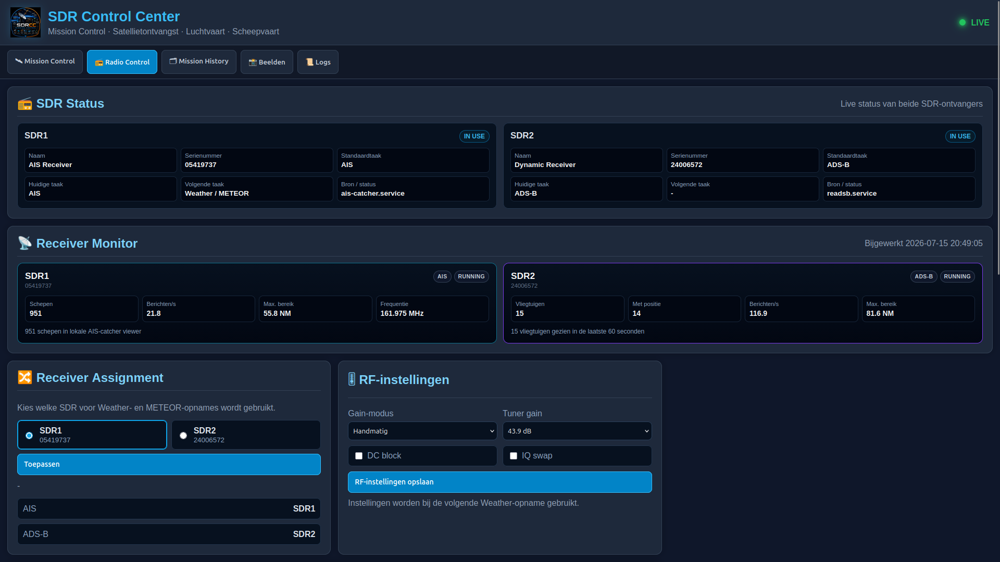
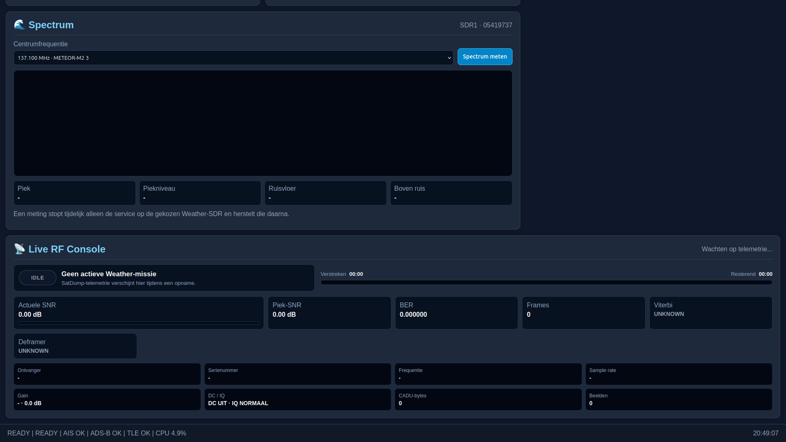
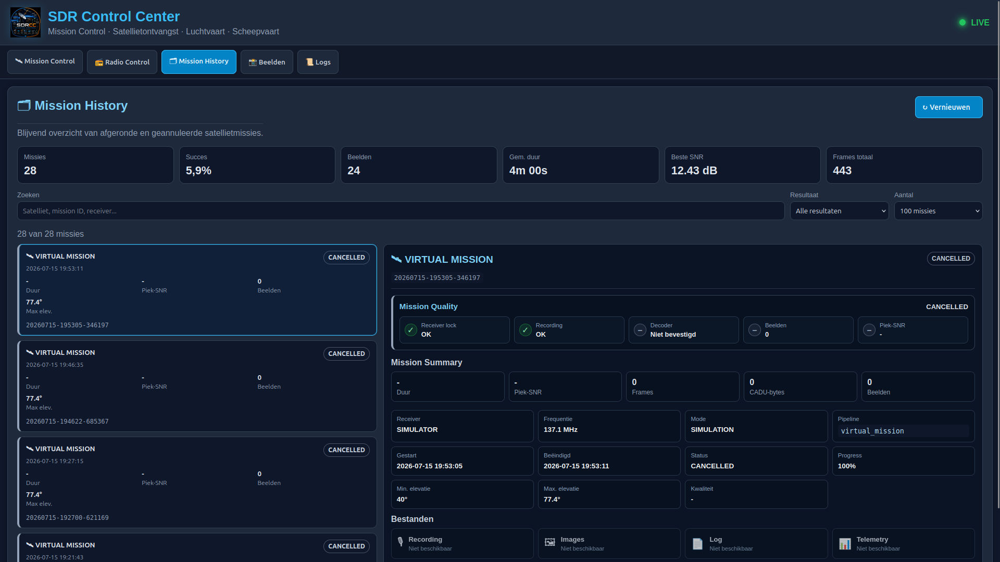
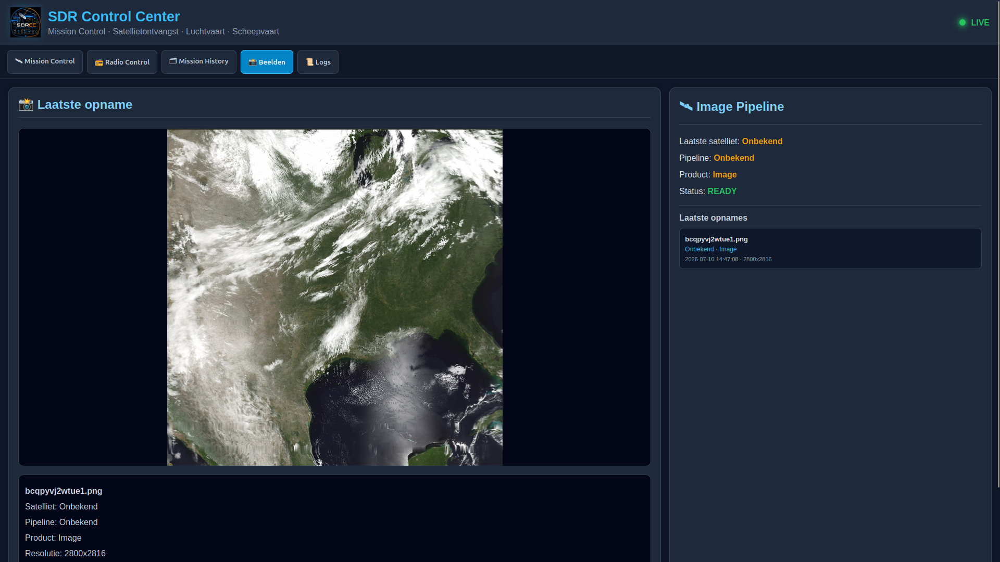
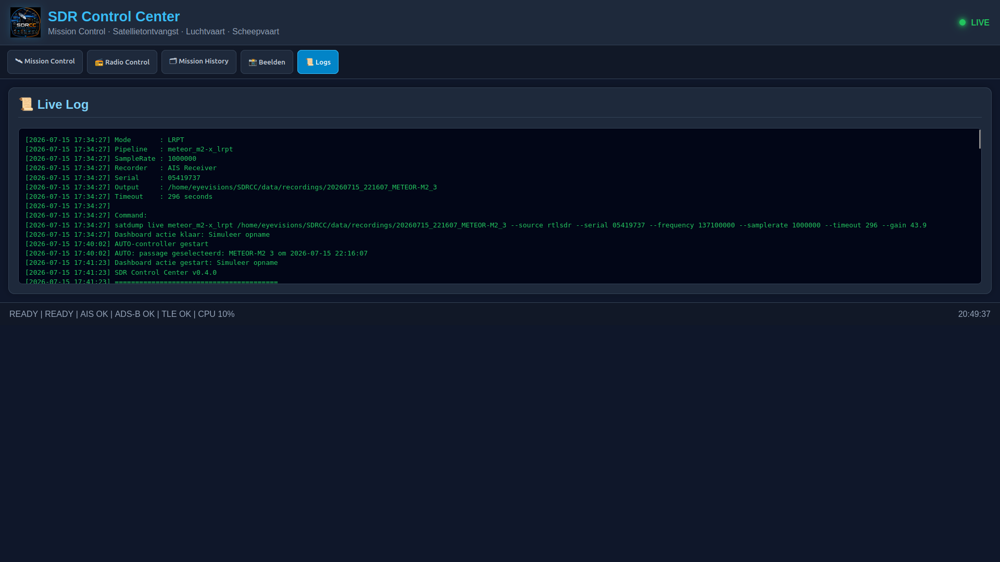

<p align="center">
  
</p>

<h1 align="center">SDR Control Center</h1>

<p align="center">
  Mission Control voor een lokaal multi-receiver SDR-groundstation.
</p>

<p align="center">
  <strong>Ontwikkelstatus: v0.21.1</strong><br>
  Ubuntu 26.04 · Python 3.14 · Flask · RTL-SDR · SatDump · AIS-catcher · readsb
</p>

## Over SDRCC

**SDR Control Center (SDRCC)** brengt satellietontvangst, AIS, ADS-B, receiverbeheer en missieautomatisering samen in één lokaal dashboard. Het systeem plant METEOR-passages, reserveert een gekozen SDR, schakelt conflicterende services gecontroleerd uit, start SatDump, bewaakt de missie en herstelt daarna de normale receivertaak.

SDRCC is ontwikkeld als een echte groundstation-cockpit: de operator ziet in één overzicht wat eraan komt, welke receiver actief is, welke services draaien en wat het resultaat van eerdere missies was.

## Huidige hardware-indeling

| Receiver | Serienummer | Normale taak | Dynamische taak |
|---|---:|---|---|
| SDR1 | `05419737` | AIS | Weather / METEOR |
| SDR2 | `24006572` | ADS-B | Weather / METEOR |

De Weather/METEOR-receiver is vanuit **Radio Control** selecteerbaar. SDRCC gebruikt uitsluitend de receiver die door de operator is gekozen. Tijdens een missie wordt alleen de conflicterende service op die receiver tijdelijk gestopt en na afloop hersteld.

## Belangrijkste functies

### Mission Control

- Mission Engine met de toestanden `READY`, `WAIT FOR PASS`, `LOCK RECEIVER`, `RECORDING`, `DECODING`, `PROCESSING` en `ARCHIVING`.
- Mission Scheduler met `AUTO`, `MANUAL` en `PAUSED`.
- Mission Queue met volledige satellietnaam, tijd, receiver, frequentie en elevatie.
- Automation Controller voor veilige voorbereiding en uitvoering.
- Event Bus en Live Event Timeline.
- Veilige **STOP MISSION**-actie met annulering, receiver-release en serviceherstel.
- Virtual Mission voor hardwarevrije workflowtests.
- Centrale frontend-`MissionState` als één bron van waarheid.
- ETA naar preflight, prepare, receiver lock en opname.

### Satellietontvangst

- Pass prediction voor **METEOR-M2 3** en **METEOR-M2 4**.
- Configureerbare minimale elevatie.
- SatDump LRPT-pipeline.
- Live RF-telemetrie: SNR, peak-SNR, BER, frames, CADU-bytes, Viterbi, Deframer en images.
- Automatische missieclassificatie, waaronder `SUCCESS`, `NO SIGNAL`, `NO SYNC`, `NO IMAGES`, `FAILED` en `CANCELLED`.
- Mission Diagnostics en opgeslagen pass-elevatie.
- Offline decode en image gallery voor alle producten van een missie.

### Receiver Monitor

- Dynamische statuskaart per fysieke SDR.
- AIS-statistieken:
  - aantal schepen;
  - berichten per seconde uit `journalctl`;
  - maximaal bereik;
  - actieve service en frequentie.
- ADS-B-statistieken:
  - aantal vliegtuigen van de laatste 60 seconden;
  - aantal vliegtuigen met positie;
  - berichten per seconde;
  - maximaal bereik.
- Weather/METEOR-status tijdens een actieve missie.

### Radio Control

- Dynamische Weather Receiver Assignment.
- Gain-modus en tuner gain.
- DC block en IQ swap.
- Korte spectrum-momentopname met `rtl_power` wanneer de gekozen SDR beschikbaar is.
- Live RF Console tijdens een SatDump-missie.

> **Spectrumbeperking:** dezelfde RTL-SDR kan niet gelijktijdig door SatDump en `rtl_power` worden geopend. De spectrummeting is daarom een korte momentopname wanneer de receiver vrij is. Tijdens een missie toont SDRCC decodertelemetrie; er is op dit moment geen live waterfall van dezelfde dongle.

### History en beelden

- Mission History met filters, KPI's en missie-details.
- Mission Quality, Mission Summary en Event Timeline.
- Inventaris van recording, images, logs, telemetry en diagnostics.
- Klikbare image gallery met alle producten uit een missie.
- Laatste ontvangst en aparte Beelden-pagina.

## Dashboard

### Mission Control


De centrale cockpit met systeemstatus, bediening, Automation Controller, Mission Queue, actuele missie, volgende passage en Live Event Timeline.

### Radio Control


Receiverstatus, AIS- en ADS-B-statistieken, Weather Receiver Assignment en RF-instellingen.



De spectrummeting werkt als idle scan. Tijdens een Weather-missie wordt de Live RF Console gevuld met SatDump-telemetrie.

### Mission History





Blijvend overzicht van voltooide, mislukte en geannuleerde missies, inclusief events, kwaliteit, bestanden en diagnostics.

### Beelden



Weergave van het nieuwste product en recente satellietbeelden.

### Logs



Live applicatielog voor scheduler-, receiver-, SatDump- en missieactiviteiten.

## Architectuur

```text
Mission Queue
      ↓
Automation Controller
      ↓
Receiver Manager
      ↓
Mission Scheduler
      ↓
Mission Engine
      ↓
SatDump
      ↓
Mission Result / Diagnostics / History / Images
```

Belangrijke ondersteunende onderdelen:

```text
Event Bus          → operationele gebeurtenissen
MissionState       → centrale frontendstatus
Receiver Monitor   → AIS, ADS-B en Weather-statistieken
Mission Operations → samengevoegde operationele API-status
```

## Missieverloop

| Moment | Actie |
|---|---|
| T-5 minuten | Preflightcontroles |
| T-90 seconden | Receiver en services voorbereiden |
| T-30 seconden | Receiver reserveren en locken |
| T-0 | SatDump starten |
| Tijdens passage | Recording en live decodertelemetrie |
| Na LOS | Decode, processing en archivering |
| Afronding | Resultaat bepalen, receiver vrijgeven en service herstellen |

## Belangrijke services

| Service | Functie |
|---|---|
| `sdrcc.service` | Flask-dashboard en SDRCC-controller |
| `ais-catcher.service` | AIS-ontvangst op de toegewezen receiver |
| `ais-catcher-control.service` | Gecontroleerd AIS-servicebeheer |
| `readsb.service` | ADS-B-ontvangst |

Status controleren:

```bash
systemctl status sdrcc.service --no-pager
systemctl status ais-catcher.service --no-pager
systemctl status readsb.service --no-pager
```

## Dashboard starten

SDRCC draait standaard op:

```text
http://127.0.0.1:8080
```

De service starten of herstarten:

```bash
sudo systemctl restart sdrcc.service
systemctl status sdrcc.service --no-pager -l
```

Recente fouten controleren:

```bash
journalctl -u sdrcc.service --since "5 minutes ago" --no-pager \
  | grep -E 'Traceback|ERROR| 500 ' || true
```

## Belangrijkste API-endpoints

| Endpoint | Functie |
|---|---|
| `GET /api/mission-operations` | Gecombineerde missie-, RF- en receiverstatus |
| `GET /api/mission-engine` | Mission Engine-status |
| `POST /api/mission/stop` | Actieve missie gecontroleerd stoppen |
| `GET /api/mission-queue` | Komende passages en queue-status |
| `GET /api/automation-controller` | Automation Controller-status |
| `GET /api/receiver-manager` | Receiverreservering en laatste release |
| `GET /api/receiver-monitor` | AIS-, ADS-B- en Weather-statistieken per SDR |
| `GET /api/live-rf` | Live SatDump-telemetrie |
| `GET /api/mission-history` | Mission History-overzicht |
| `GET /api/mission-history/<id>` | Details, events, files en gallery van een missie |
| `GET /api/capture-status` | Laatste beschikbare afbeelding |

## Projectstructuur

```text
SDRCC/
├── config/                    # Station-, profiel- en satellietconfiguratie
├── core/
│   ├── automation_controller.py
│   ├── event_bus.py
│   ├── live_rf.py
│   ├── mission_diagnostics.py
│   ├── mission_engine.py
│   ├── mission_operations.py
│   ├── mission_queue.py
│   ├── mission_result.py
│   ├── mission_scheduler.py
│   ├── receiver_manager.py
│   ├── receiver_monitor.py
│   └── satdump.py
├── dashboard/
│   ├── app.py
│   ├── static/
│   └── templates/
├── data/
│   ├── recordings/
│   ├── state/
│   └── tle/
├── docs/screenshots/
├── scripts/
├── README.md
└── VERSION
```

## Ontwikkeling

De actieve ontwikkelbranch is:

```text
develop
```

Voor iedere wijziging:

```bash
cd ~/SDRCC
git status
git diff --check
git log --oneline -5
```

De ontwikkelwerkwijze bestaat uit kleine, testbare commits. Grote wijzigingen worden eerst geanalyseerd; de dashboardlayout wordt alleen gewijzigd wanneer dat expliciet nodig is.

## Roadmap

### v0.22 — Live Weather Mission

- echte METEOR-missie van preflight tot imageproduct verder valideren;
- live SatDump-telemetrie verfijnen;
- spectrum-momentopname afronden met frequentie-as, piek en ruisvloer;
- nieuwste missiebeelden automatisch en correct aan missiegegevens koppelen;
- operationele diagnose van decoder- en imagepipeline verbeteren.

### v0.23 — Mission Analytics

- SNR- en framestatistieken per missie;
- prestaties per satelliet en elevatie;
- succespercentage en ontvangstkwaliteit;
- historische trends en beste ontvangst.

### Richting v1.0

- volledig autonome groundstation-workflow;
- pluginarchitectuur voor extra SDR-toepassingen;
- stabiele installatie- en upgradeprocedure;
- uitgebreide health monitoring en foutdiagnose;
- publieke, gedocumenteerde API v1.

## Opmerking

SDRCC is momenteel afgestemd op de lokale hardware- en serviceconfiguratie van dit groundstation. Controleer serienummers, service-namen, locatie, antennes en frequenties voordat het project op een andere installatie wordt gebruikt.
