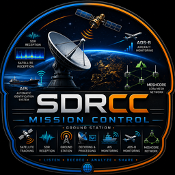
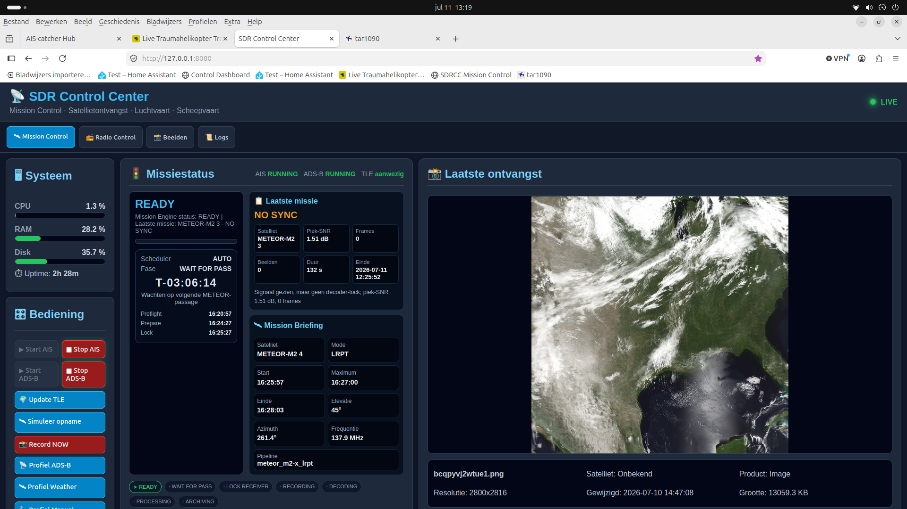
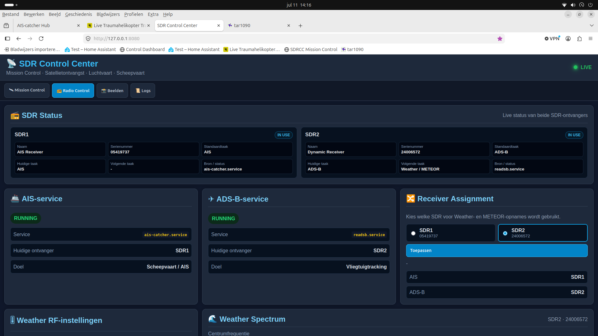

<p align="center">
  
</p>

<h1 align="center">SDR Control Center</h1>

<p align="center">
  Mission Control voor een multi-receiver Software Defined Radio ground station.
</p>

<p align="center">
  <strong>Versie 0.14.3</strong> · Ubuntu · Python · Flask · RTL-SDR · SatDump
</p>

## Over SDRCC

SDR Control Center, kortweg **SDRCC**, brengt satellietontvangst, AIS, ADS-B en SDR-beheer samen in één lokaal dashboard. Het systeem plant METEOR-passes, beheert ontvangers en services, start SatDump automatisch en registreert het resultaat van elke missie.

De huidige installatie gebruikt twee RTL-SDR-ontvangers met dynamische taaktoewijzing. De Weather/METEOR-ontvanger kan vanuit het dashboard aan SDR1 of SDR2 worden toegewezen.

## Belangrijkste functies

- Mission Engine met toestanden van `READY` tot `ARCHIVING`
- AUTO, MANUAL en PAUSED Mission Scheduler
- TLE-update en pass prediction voor METEOR-M2 3 en METEOR-M2 4
- Automatische voorbereiding, receiver-lock, opname, decode en herstel
- Mission Timeline en opgeslagen missie-uitkomsten
- Resultaten zoals `SUCCESS`, `NO SYNC`, `NO SIGNAL` en `FAILED`
- AIS-servicebeheer via `ais-catcher.service`
- ADS-B-servicebeheer via `readsb.service`
- Dynamische Weather Receiver Assignment voor SDR1 of SDR2
- RF-instellingen voor gain, DC block en IQ swap
- Weather-spectrumdiagnose via `rtl_power`
- Live systeemstatus, laatste ontvangst, beeldweergave en logs
- Automatische start van het SDRCC-dashboard via systemd

## Dashboard

### Mission Control



Mission Control toont de systeemstatus, missiestatus, laatste missie, laatste ontvangst, volgende passage en de Mission Timeline.

### Radio Control



Radio Control toont de actuele taken van beide SDR-ontvangers, AIS- en ADS-B-services, receiver assignment, RF-instellingen en spectrumdiagnose.

## Huidige hardware-indeling

| Ontvanger | Serienummer | Standaardtaak | Dynamische taak |
|---|---:|---|---|
| SDR1 | `05419737` | AIS | Weather / METEOR |
| SDR2 | `24006572` | ADS-B | Weather / METEOR |

De Weather/METEOR-taak is via het dashboard selecteerbaar. Tijdens een missie stopt SDRCC alleen de conflicterende service op de gekozen ontvanger en herstelt deze na afloop.

## Missieverloop

| Moment | Actie |
|---|---|
| T-5 minuten | Preflight |
| T-90 seconden | Receiver voorbereiden |
| T-30 seconden | Receiver lock |
| T-0 | SatDump starten |
| Na passage | Resultaat analyseren, service herstellen en profiel terugzetten |

## Projectstructuur

```text
SDRCC/
├── config/                 # Station-, profiel- en schedulerconfiguratie
├── core/                   # Mission Engine, scheduler, SatDump en RF-logica
├── dashboard/              # Flask-app, templates, JavaScript, CSS en assets
├── data/                   # TLE, state, opnames en gegenereerde data
├── scripts/                # CLI en onderhoudsscripts
├── logs/                   # SDRCC-logbestanden
├── README.md
└── VERSION
```

## Starten

SDRCC draait als systemd-service:

```bash
sudo systemctl start sdrcc.service
systemctl status sdrcc.service --no-pager
```

Dashboard:

```text
http://127.0.0.1:8080
```

Vanaf een ander apparaat gebruik je het LAN-adres van de SDRCC-computer, bijvoorbeeld:

```text
http://192.168.178.34:8080
```

AIS en ADS-B worden bewust handmatig gestart vanuit het Control Panel. Alleen het SDRCC-dashboard start automatisch na een reboot.

## Ontwikkelstatus

**v0.14.3** bevat onder andere:

- vernieuwde Mission Control-layout
- horizontale kaart voor de volgende passage
- Mission Result en Mission History
- configureerbare Weather Receiver Assignment
- dynamische SDR-taakstatus
- RF-instellingen en spectrumdiagnose
- vernieuwde SDRCC-branding

## Roadmap

### v0.15 — Live RF Console

- live spectrum
- waterfall
- live SNR en peak hold
- decoder-lock, Viterbi- en deframerstatus
- framecounter en ontvangsttelemetrie tijdens een passage

### v0.16

- uitgebreidere beeldgalerij
- meerdere satellietprofielen
- extra decoder- en opnamepijplijnen

### v1.0

- volledig autonome multi-SDR ground station controller
- stabiele installatie- en upgradeprocedure
- uitgebreide status-, fout- en herstelrapportage

## Ontwikkeling

De actieve ontwikkelbranch is:

```text
develop
```

Controleer vóór wijzigingen altijd:

```bash
cd ~/SDRCC
git status
git log --oneline -5
```

## Opmerking

SDRCC is momenteel afgestemd op de lokale hardware- en serviceconfiguratie van het ground station. Controleer serienummers, service-namen, locatie en frequenties voordat je het project op een andere installatie gebruikt.
