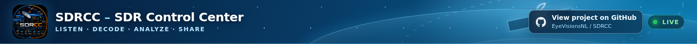
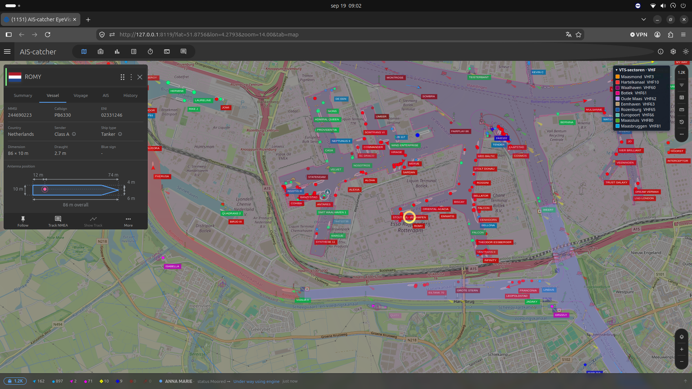
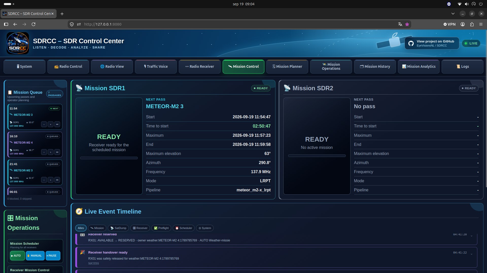
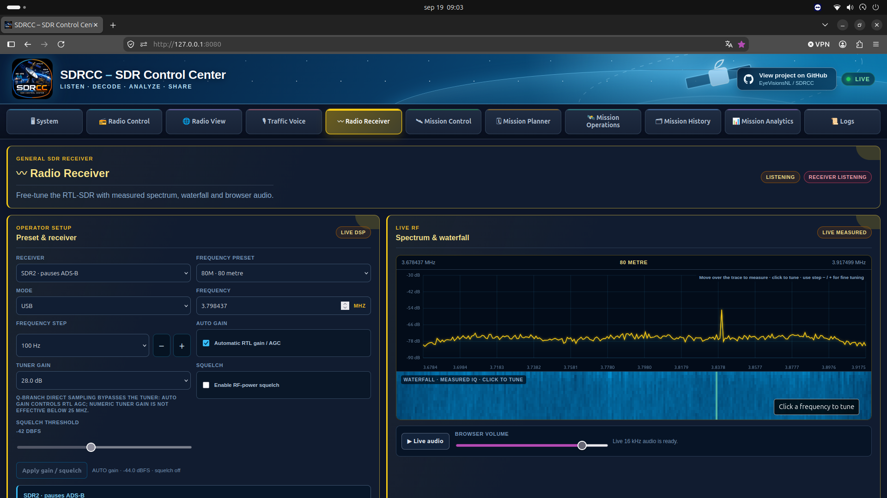
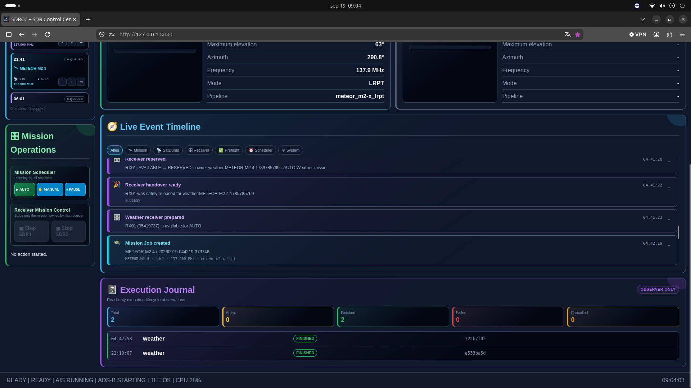
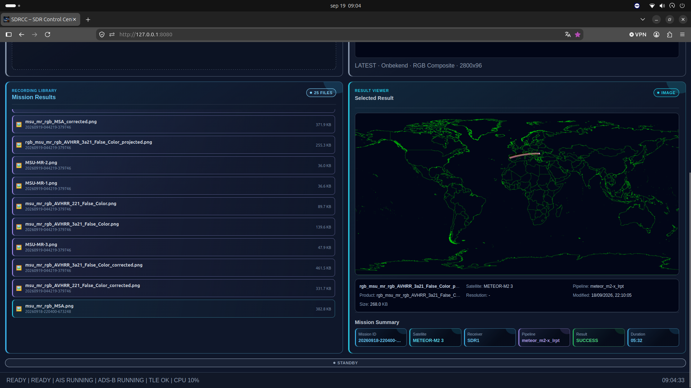
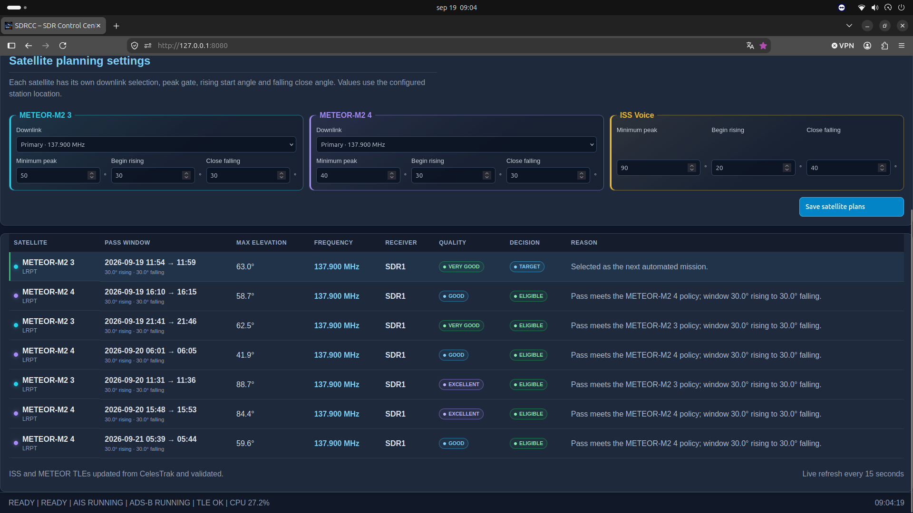
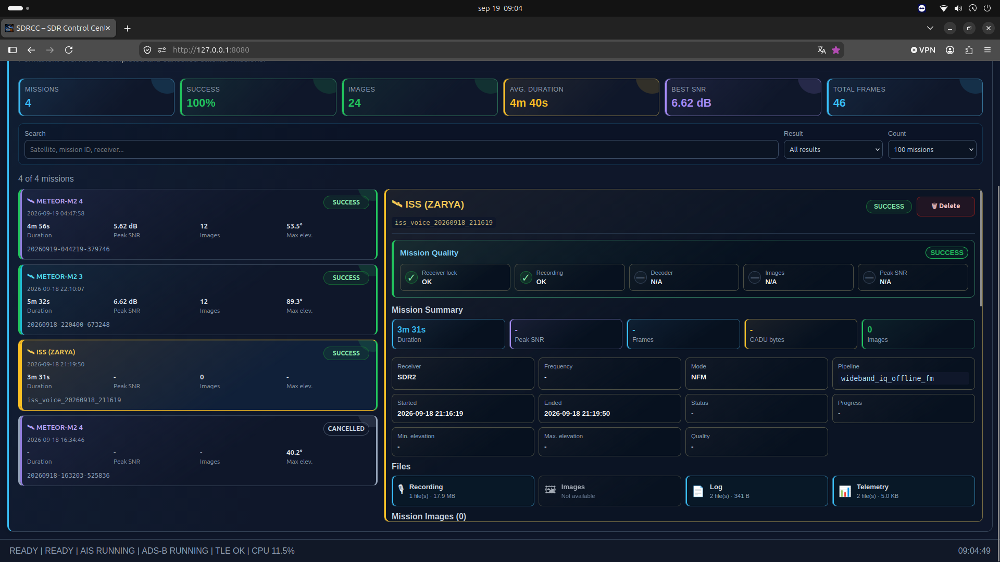

<p align="center">
  
</p>

<h1 align="center">SDRCC — SDR Control Center</h1>

<p align="center">
  <strong>Listen · Decode · Analyze · Share</strong>
</p>

<p align="center">
  Radio, ships, aircraft and satellites — brought together in one SDR control center.
</p>

<p align="center">
  
</p>

## 📡 What is SDRCC?

What started with a couple of SDR receivers and the question *“what else can we do with these?”* has grown into **SDRCC**.

SDRCC brings **radio reception, AIS and marine ATIS, ADS-B and satellite missions** together in one browser dashboard. Listen to radio traffic, follow ships and aircraft, plan satellite passes and let SDRCC manage which receiver is needed where.

No cloud platform required. Just radios, antennas, Linux... and probably a few more cables than originally planned. 😄

SDRCC is designed around multiple RTL-SDR receivers, but the logical SDR slots are not tied forever to one physical dongle. Receivers can be replaced or rebound from the dashboard while Receiver Manager handles reservations, temporary handovers and restoration of the previous service.

## 🌍 One screen, several worlds

**✈️ Aircraft · 🚢 Ships · 🛰️ Satellites · 📻 Radio**



**Radio View** gives you the quick picture: aircraft from ADS-B, vessels from AIS and satellites currently moving over the station.

## 🎙️ Wait... which ship was that?

Traffic Voice is where radio audio meets the traffic data SDRCC already has.

In **Marine Voice + AIS**, SDRCC can scan marine VHF channels, decode marine **ATIS (Automatic Transmitter Identification System)** identities and correlate validated ATIS traffic with current AIS vessel data.

When a correlation is found, **Possible Speaker** shows the vessel, callsign and matching information next to the live receiver.



The **Auto** function can follow newly validated matches in the AIS-catcher map. The same map window is reused, and the chosen zoom level is retained.



> Hearing marine traffic is fun. Knowing which ship you're hearing makes it a little more interesting. 🚢🎙️

A match depends on the ATIS and AIS information available at that moment, so **Possible Speaker** is exactly what the name says: useful correlation information for the operator, not a claim that every transmission can always be identified.

Traffic Voice also supports **Airband Voice + ADS-B**, fixed-channel listening, channel scanning, scan exclusions, adjustable scan speed, squelch, Auto Gain/manual gain and Excel channel-list import/export.

## 📻 Sometimes you just want a radio



Not everything needs to be a mission.

The built-in **Radio Receiver** turns an available RTL-SDR into a browser-controlled receiver with live audio, spectrum and waterfall.

Tune directly or use presets. Supported modes include **LSB, USB, CW, AM, NFM, FM and WFM**, with tuning steps, click-to-tune, RF-power squelch and Auto Gain/manual gain.

Receiver Manager takes care of borrowing the SDR from another role and restoring its previous job when you're finished.

## 🛰️ Satellites don't wait for you

Fortunately, SDRCC can do the waiting.

**Mission Planner** calculates upcoming passes and applies the reception rules configured for each satellite.



**Mission Control** shows what's coming next, which receiver will be used and what the scheduler is doing.



When it's time, SDRCC reserves the required receiver, handles conflicting receiver services and starts the mission. After the pass, the receiver is released and its previous context can be restored.

### And hopefully...



...you get something from space. 🌍📡

**Mission Operations** keeps received products with their mission. Mission History and Mission Analytics provide the deeper view when you want to inspect results, telemetry, Peak SNR and receiver performance.

SDRCC currently supports automated **METEOR-M2 3 / METEOR-M2 4 LRPT** reception through SatDump and **ISS Voice** pass planning and reception.

## 🚢 AIS, ✈️ ADS-B and a bit more

SDRCC doesn't try to reinvent everything.

It connects several excellent open-source radio projects and adds receiver management, automation and one common dashboard around them.

Continuous AIS and ADS-B reception can run alongside temporary jobs such as Traffic Voice, the Radio Receiver and satellite missions. SDRCC's Receiver Manager coordinates the handover when two jobs want the same physical receiver.

## 🔌 Receiver management without the USB-number headache

Physical receivers are mapped to logical **SDR1 / SDR2** slots under **System → Receiver hardware + bindings**.

The receiver identity is kept by serial rather than by a changing USB index. A slot can also be set to **None**, so installation and configuration do not require every receiver to be connected permanently.

Roles such as AIS and ADS-B can be reassigned from the dashboard. SDRCC stops conflicting Traffic Voice activity before applying those assignments so a forgotten voice session does not quietly keep the dongle busy.

## 🗺️ A little extra around Rotterdam

Some development screenshots may show **VTS Rijnmond sectors and VHF channels** on the AIS-catcher map.

That overlay is a separate EyeVisionsNL project built around public Rijkswaterstaat VTS data. It is not required for SDRCC and is not part of AIS-catcher itself.

It is simply one of those *“wouldn't it be useful if...”* side projects that grew around the station. 😄

## ❤️ Projects that make SDRCC possible

SDRCC stands on the shoulders of some excellent open-source projects. These are independent projects with their own authors, licenses and communities — and they deserve the credit.

| Project | What SDRCC uses it for |
|---|---|
| [SatDump](https://github.com/SatDump/SatDump) | Satellite demodulation, decoding and METEOR LRPT products |
| [AIS-catcher](https://github.com/jvde-github/AIS-catcher) | AIS reception, decoding, statistics and vessel viewer |
| [AIS-catcher-control](https://github.com/jvde-github/AIS-catcher-control) | AIS-catcher management/control tooling |
| [readsb](https://github.com/wiedehopf/readsb) | ADS-B reception and aircraft data |
| [RTLSDR-Airband](https://github.com/rtl-airband/RTLSDR-Airband) | Marine and Airband Traffic Voice backend |
| [librtlsdr / rtl-sdr](https://github.com/steve-m/librtlsdr) | Access to RTL2832U-based SDR receivers |

If SDRCC is useful to you, please have a look at the upstream projects too. ❤️

## 🔧 Getting started

SDRCC is developed and tested on **Ubuntu Linux x86-64**. Ubuntu Desktop is the main development/test environment; Ubuntu Server can also be used when the dashboard is operated remotely.

The full SDRCC workload is intended for a small x86-64 PC rather than a Raspberry Pi. Raspberry Pi OS is used for some separate EyeVisionsNL AIS experiments and companion projects, but is not the reference SDRCC runtime.

### Fresh installation

Run the installer as your normal Ubuntu user. Do **not** put `sudo` in front of `./install.sh`; the installer requests elevated privileges itself when needed.

```bash
sudo apt-get update
sudo apt-get install -y git
git clone --depth 1 --branch main https://github.com/EyeVisionsNL/SDRCC.git ~/SDRCC
cd ~/SDRCC
./install.sh
```

During installation SDRCC asks for the station name, location, latitude, longitude and altitude. These values are used for station-relative functions such as satellite pass planning.

The installer also guides the AIS-catcher setup. Receiver hardware can be configured later if the SDRs are not connected during installation.

### Existing installation

Current SDRCC installations include the managed updater in **System → Advanced Maintenance**. It checks the published SDRCC update metadata, shows the available version and release notes, and runs the managed update workflow when you explicitly start it.

Local station settings, receiver bindings and runtime data are kept outside the code replacement path.

### AIS setup later

If AIS setup was deferred during installation:

```bash
cd ~/SDRCC
./install.sh --ais-setup
```

Stop active missions and Radio Receiver sessions before running the explicit AIS setup workflow.

### Uninstall

```bash
~/SDRCC/uninstall.sh
```

The receipt-aware uninstall removes SDRCC and removes externally provisioned radio applications only when the installation receipt shows that SDRCC installed them. Shared Ubuntu packages are preserved.

## 🖥️ Dashboard

The navigation brings the station together in one place:

`System · Radio Control · Radio View · Traffic Voice · Radio Receiver · Mission Control · Mission Planner · Mission Operations · Mission History · Mission Analytics · Logs`

**System** handles health, detected hardware, receiver bindings and maintenance.

**Radio Control** shows receiver status, assignments and RF settings.

**Mission History & Analytics** keep the technical detail available without turning the README into an operations manual.

The deeper architecture, validation notes and version-specific implementation details live in the [docs](docs/) directory.

## 🧪 Still evolving

SDRCC is an active project and is currently on the **v0.56.0x / v1.0 preparation** development line.

A lot of its features came from actually using the station: receivers fighting over the same dongle, wondering which vessel was talking, missing a satellite pass, wanting to borrow the ADS-B receiver as an ordinary radio...

Usually the next feature starts with:

**“Wouldn't it be nice if...”**

...and then somehow turns into another button. 😄

Development happens on the `develop` branch first. Changes are reviewed and validated before they move to `main`.

---

<p align="center">
  <strong>SDRCC — SDR Control Center</strong><br>
  Radio · AIS · ATIS · ADS-B · Satellites
</p>
