<p align="center">
  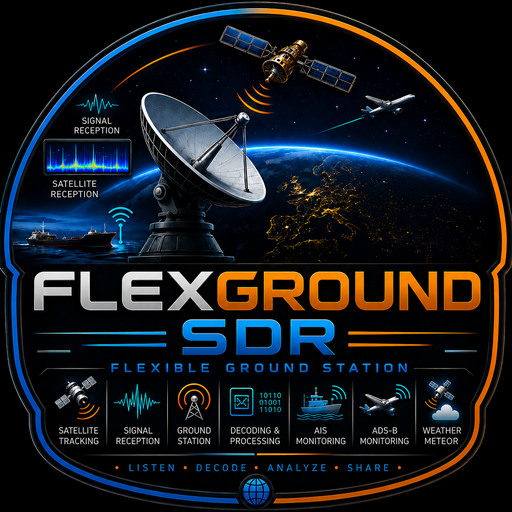
</p>

<h1 align="center">FlexGround SDR</h1>

<p align="center">
  Flexible SDR Ground Station for satellite reception, AIS, ADS-B, intelligent traffic voice and wideband live radio monitoring.
</p>

<p align="center">
  <strong>Current development line: v0.56.0o · v1.0 preparation</strong><br>
  Ubuntu 26.04 · Python 3.14 · Flask · RTL-SDR · SatDump · AIS-catcher · readsb · RTLSDR-Airband
</p>

<p align="center">
  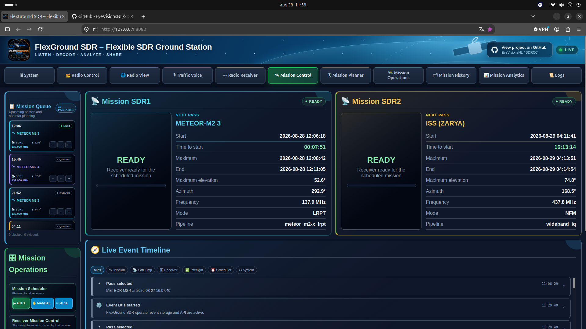
</p>

## What is FlexGround SDR?

**FlexGround SDR** is a flexible software-defined-radio ground station for local radio monitoring and automated satellite missions. It combines multiple physical RTL-SDR receivers, continuous radio services and scheduled missions in one dashboard. It plans satellite passes, assigns work to the correct receiver, coordinates temporary receiver handovers, records mission lifecycle events and restores the exact pre-mission receiver context when work finishes or fails.

The project was previously presented as **SDR Control Center (SDRCC)**. Existing technical identifiers such as `sdrcc.service`, `/home/eyevisions/SDRCC`, environment variables, API contracts and browser events are intentionally retained for backward compatibility.

The current reference station uses two NESDR SMArt v5 receivers:

| Receiver | Normal context | Mission / temporary roles |
|---|---|---|
| SDR1 | AIS | Weather / METEOR LRPT, Airband Voice |
| SDR2 | ADS-B | ISS Voice, Marine Voice, Radio Receiver |

These values describe the reference installation, not hard-coded product requirements. v1.0 installer work detects RTL-SDR hardware by serial and keeps station/location configuration separate from external-service provisioning.

## Main capabilities

- Dual-SDR receiver architecture with serial-based identity and receiver-specific planning.
- Automated METEOR-M2 3 / METEOR-M2 4 LRPT missions through SatDump.
- ISS Voice pass planning, controlled wideband-IQ capture and offline audio processing.
- Mission Scheduler with `AUTO`, `MANUAL` and `PAUSED` modes.
- Per-satellite minimum peak, rising start angle and falling close angle.
- Receiver Manager handover with reservation and exact pre-start service restoration.
- Continuous AIS and ADS-B reception with live statistics and embedded viewers.
- Marine NFM + AIS and Airband AM + ADS-B Traffic Voice modes.
- Traffic Voice fixed-channel/scan operation, scan exclusions, squelch, native Auto Gain and Excel channel-list import/export.
- **Marine ATIS decoding + AIS correlation:** decodes and validates the **Automatic Transmitter Identification System (ATIS)** identity from marine VHF traffic, correlates it with live AIS vessel data and can automatically follow validated vessel matches with **Auto** mode.
- General **Radio Receiver** with free tuning from 0.5 to 1766 MHz, frequency presets and LSB, USB, CW, AM, NFM, FM and WFM modes.
- Measured spectrum and waterfall from the same live IQ stream used for browser audio.
- Spectrum hover measurement with frequency/dBFS/offset, click-to-tune, tuning steps and live frequency retuning.
- Radio Receiver Auto Gain/manual gain and RF-power squelch.
- Mission Operations workspace for live missions and decoded results.
- Persistent Mission History with mission diagnostics, files, telemetry and images.
- Mission Analytics with receiver/satellite performance, Peak SNR and historical RF-gain comparison.
- Multi-source logs and bounded runtime/log retention.
- v1.0 installer foundation with pinned third-party provisioning and fail-closed validation.

## Dashboard

The current navigation is:

`System · Radio Control · Radio View · Traffic Voice · Radio Receiver · Mission Control · Mission Planner · Mission Operations · Mission History · Mission Analytics · Logs`

### System

System Health, receiver inventory, manual AIS/ADS-B service control and deliberately separated advanced maintenance actions.

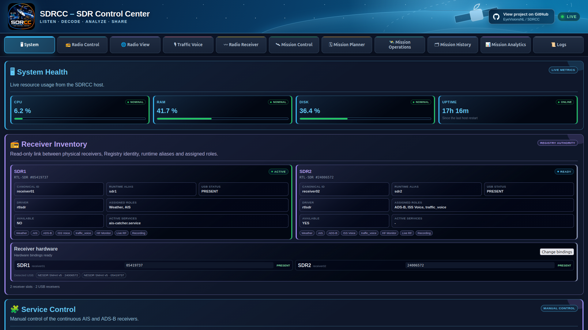

### Radio Control

Operational receiver status, read-only runtime diagnostics, receiver-role assignments and Weather/METEOR and ISS Voice RF settings. Persistent role assignment remains separate from temporary runtime handover.

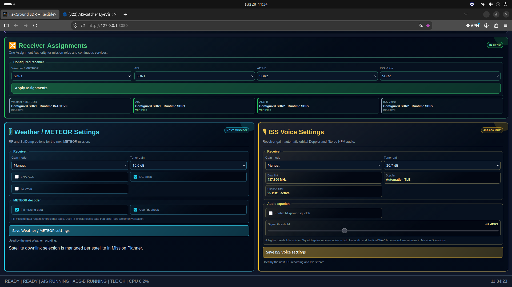

### Radio View

A shared live overview of ADS-B traffic, AIS traffic and satellite positions/ground tracks.

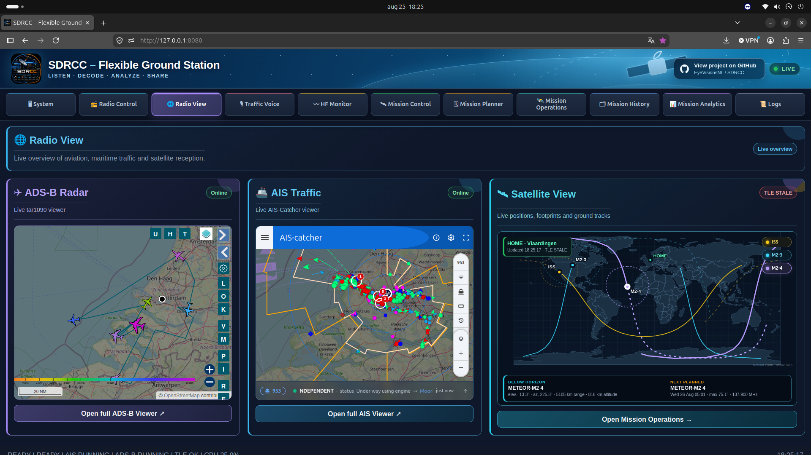

### Traffic Voice

Traffic Voice is more than a channel scanner: it combines live voice reception with the traffic context already available to FlexGround SDR.

- **Marine Voice + AIS** — NFM marine VHF while AIS remains the live vessel context.
- **Airband Voice + ADS-B** — AM aviation voice while ADS-B remains the live aircraft context.
- Fixed-channel listening or scanning with per-channel scan exclusions.
- Live browser audio, squelch, native RTL-SDR Auto Gain/manual gain and validated `.xlsx` channel-list import/export.
- Transaction-safe switching and exact receiver/service restoration through Receiver Manager.

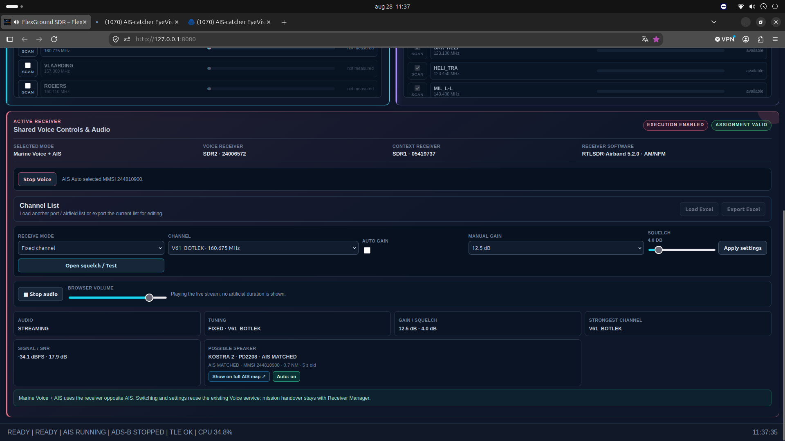

#### Marine ATIS decoding, AIS correlation and Auto follow

In **Marine Voice + AIS**, FlexGround SDR decodes the marine **ATIS (Automatic Transmitter Identification System)** identity transmitted with VHF traffic. After validation, that ATIS identity is correlated with current AIS data to identify a **Possible Speaker**. A validated match exposes the vessel identity and AIS context directly beside the live audio controls.

The **Auto** button turns the ATIS-to-AIS correlation into an operator workflow: when **Auto: on** is enabled, newly validated vessel matches are followed automatically in the operator-approved AIS-Catcher map window. The same map window is reused instead of opening a new window for every match.

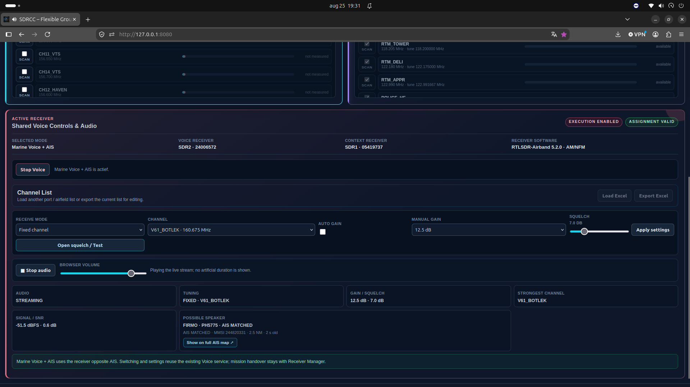

The normal **Show on full AIS map** action remains available for manual verification. This makes it possible to move directly from *hearing a transmission* to *seeing the likely vessel and its live position*.

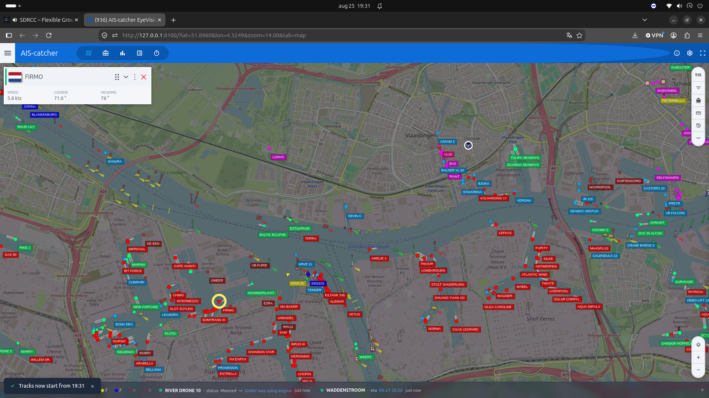

`config/traffic_voice.yaml` remains the Traffic Voice configuration authority. ATIS decoding, AIS correlation and Auto follow do not create a second receiver or service authority; receiver handover remains owned by Receiver Manager.

### Radio Receiver

The **Radio Receiver** is the general-purpose live SDR workspace. It expands the former HF Amateur Monitor into a receiver that can free-tune across the practical RTL-SDR range used by FlexGround SDR: **0.5 to 1766 MHz**.

Frequency presets provide quick starting points for amateur HF bands, shortwave, Airband, Marine VHF, 2 m, broadcast FM, 70 cm, PMR446 and ADS-B, while **Custom / free tune** allows direct frequency entry.

Supported modes are **LSB, USB, CW, AM, NFM, FM and WFM**. The same measured `librtlsdr` IQ stream supplies the spectrum, waterfall, DSP and browser audio.

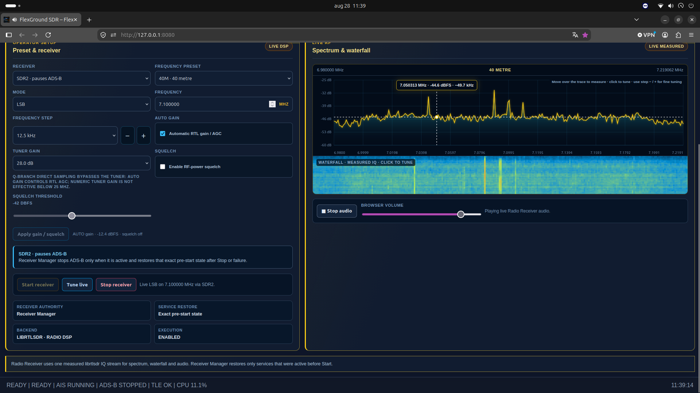

The live RF display supports frequency divisions, hover measurement with **MHz, dBFS and frequency offset**, spectrum/waterfall click-to-tune, selectable tuning steps and `− / +` fine tuning. Auto Gain/manual tuner gain and RF-power squelch remain available. Below 25 MHz the existing Q-branch direct-sampling path is used; above it the normal tuner path is used. Receiver Manager retains the handover and restores the exact pre-start service state after Stop or failure.

### Mission Control

Mission Control is the operational cockpit: receiver-specific Mission Queue, next mission for SDR1/SDR2, scheduler controls, stop controls, Live Event Timeline and the read-only Execution Journal.


### Mission Planner

Mission Planner combines pass prediction, per-satellite planning policy, receiver assignment, conflict detection and the final planning decision. Each satellite can have its own downlink, minimum peak elevation, rising start angle and falling close angle.

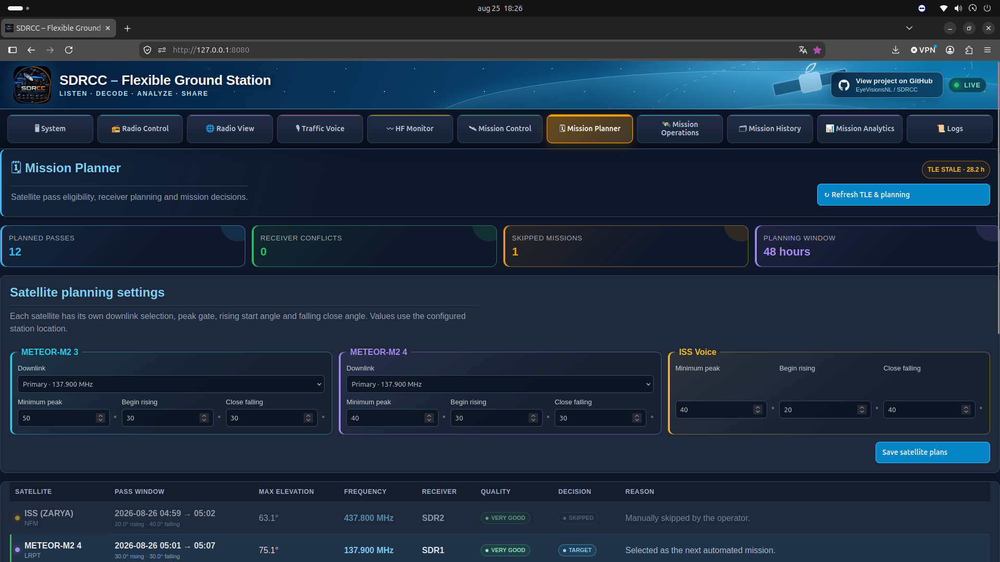

### Mission Operations

Mission Operations is the live and result workspace. During a mission it presents active receiver details; outside a mission it keeps historical products available. Decoded Weather products can be browsed directly from the recording library and result viewer.

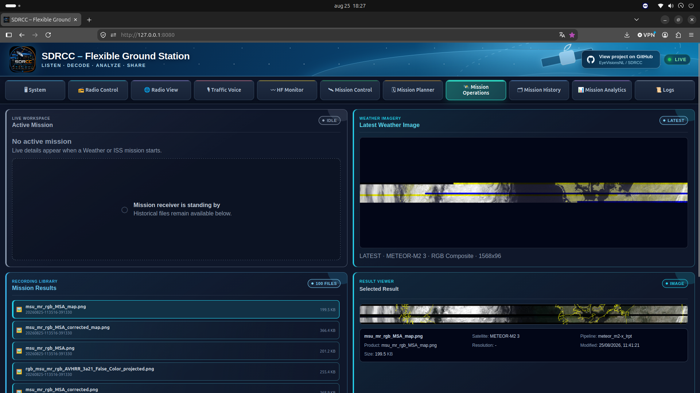

### Mission History

Mission History is the persistent record of completed, failed, no-sync and cancelled missions. It exposes mission quality, receiver/frequency/pipeline metadata, files, telemetry and decoded images without turning historical data into active runtime state.

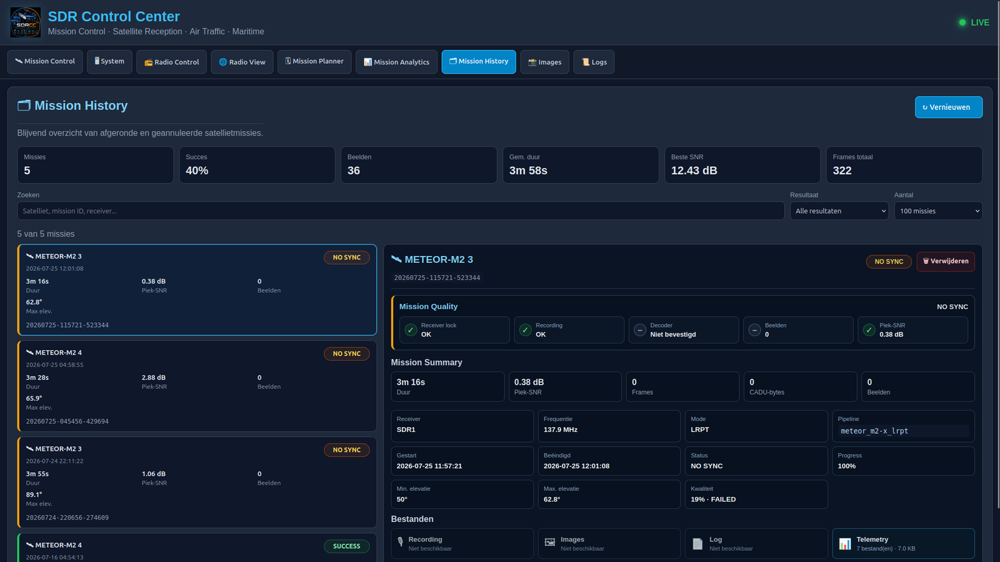

### Mission Analytics

Mission Analytics aggregates stored mission history into receiver and satellite performance, Peak SNR trends, images per mission, result/quality distributions and **RF Gain vs Peak SNR**. Historical Auto Gain is shown as `Auto Gain`; older records without gain metadata remain explicitly unknown.

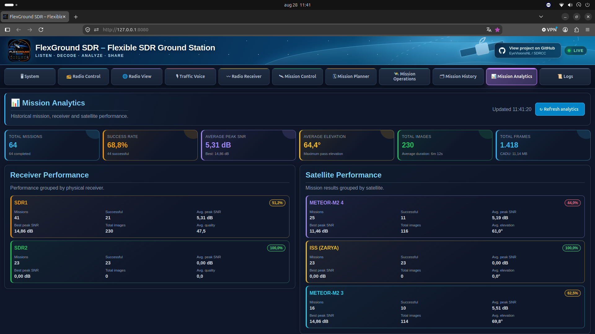

### Logs

The Logs page provides the operational log view for FlexGround SDR and its relevant mission/runtime sources. Runtime log retention rotates the legacy-compatible `logs/sdrcc.log` at 10 MiB with three retained backups.

## Architecture and authority

FlexGround SDR follows a single-owner rule: every operational state or hardware action has one authority. UI pages and observer components may project that state, but must not create a competing truth.

```text
Pass Prediction / Planning Policy
              ↓
       Mission Scheduler
       + Mission Queue
              ↓
         Mission Engine
              ↓
        Receiver Manager
        ↙             ↘
 Receiver handover   Execution/runtime adapters
        ↓                    ↓
 AIS / ADS-B / Radio Receiver / Voice / SatDump / Capture
              ↓
 Mission History · Analytics · Operations · Journal
```

Core boundaries:

| Concern | Authority |
|---|---|
| Physical receiver identity / serial | Receiver Registry |
| Persistent receiver roles | Station assignment configuration |
| Receiver reservation, handover and exact restoration | Receiver Manager |
| Future mission queue and scheduler mode | Mission Scheduler |
| Active mission lifecycle and result | Mission Engine |
| Hardware/backend execution | Existing bounded plugin/adapter/backend |
| Historical mission records | Mission History |
| Historical aggregation | Mission Analytics |
| Execution lifecycle observation | Execution Journal — observer only |
| UI/API presentation | Dashboard — not an independent state authority |

Radio Receiver and Traffic Voice reuse these boundaries. Neither introduces a second receiver registry, lock mechanism or service controller.

## Mission lifecycle

| Moment | Action |
|---|---|
| T-5 min | Preflight and policy checks |
| T-90 s | Prepare receiver and dependencies |
| T-30 s | Reserve receiver and capture restore context |
| T-0 | Start capture/decoder execution |
| During pass | Update measured status, events and telemetry |
| After LOS | Finish processing and classify the result |
| Completion | Archive history and restore/release the receiver |

## Runtime data and retention

Mission History remains the manual whole-mission deletion authority.

For successful ISS Voice captures, FlexGround SDR may remove `recording.iq` only after WAV validation and successful receiver-context restoration. Failed or incomplete missions retain raw IQ for diagnosis. Setting `iss_voice.storage.keep_raw_iq: true` disables automatic IQ removal.

The main FlexGround SDR runtime log rotates at 10 MiB with three retained backups.

## Important services

| Service | Purpose |
|---|---|
| `sdrcc.service` | FlexGround SDR Flask dashboard and runtime |
| `ais-catcher.service` | Continuous AIS reception |
| `ais-catcher-control.service` | AIS-Catcher maintenance/control interface |
| `readsb.service` | Continuous ADS-B reception |
| `sdrcc-traffic-voice.service` | Selected Marine NFM or Airband AM reception |

External receiver services are deliberately not enabled automatically by the v1 installer provisioning stage.

## v1.0 installation foundation

v0.56.0j/k introduced the generic installer and external provisioning foundation. The legacy-compatible technical identifiers remain unchanged during the FlexGround SDR rebrand.

Important installer properties:

- Default project location: `<install-user-home>/SDRCC`.
- No reference-user or reference-city values are embedded in the installer.
- RTL-SDR identity is persisted by serial, never by USB index.
- FlexGround SDR service units, Traffic Voice service, sudoers boundary and receiver-role helper are reproducible from repository sources.
- Third-party provisioning is pinned and validated.
- Provisioning installs software but does not take receiver/service authority away from FlexGround SDR.
- Uninstall preserves runtime data by default.
- Installation and provisioning fail closed when required validation fails.

### Pinned external reference stack

| Component | v0.56.0k reference |
|---|---|
| SatDump | Ubuntu `satdump` + `satdump-data`; Ubuntu 26.04 reference package 1.2.2+gb79af48-2 |
| readsb | `wiedehopf/readsb`, commit `cc0d099`, Debian package with RTL-SDR support |
| AIS-catcher | official installer pinned to release `v0.70` |
| AIS-catcher-control | official installer, validated as release `v0.1` before execution |
| RTLSDR-Airband | tag `v5.2.0`, commit `61c5c4061967752da6b491a924664d72184b38fa`, SDRCC Auto Gain patch |

`provision_external.sh --check` is read-only and `--plan` prints the pinned provisioning plan. `install.sh --skip-third-party` is intended only for systems where the complete reference stack is already present and passes validation.

> v0.56.0k does not yet claim fully unattended first-run AIS managed-mode configuration. The installer reports that boundary instead of guessing station-specific AIS settings.

Detailed clean-machine installation commands should be taken from the release package itself while v1.0 installer validation is still in progress.

## Third-party software and credits

FlexGround SDR coordinates and integrates several independent open-source projects. Those projects remain separate works with their own authors, licenses and support channels.

| Project | Role in the FlexGround SDR reference stack | Upstream |
|---|---|---|
| SatDump | Satellite demodulation and decoding, including METEOR LRPT | https://github.com/SatDump/SatDump |
| AIS-catcher | AIS reception, decoding, statistics and local vessel viewer | https://github.com/jvde-github/AIS-catcher |
| AIS-catcher-control | Companion management/control layer for AIS-catcher | https://github.com/jvde-github/AIS-catcher-control |
| readsb | ADS-B reception and aircraft data | https://github.com/wiedehopf/readsb |
| RTLSDR-Airband | Marine/Airband Traffic Voice backend in the v1 reference stack | https://github.com/rtl-airband/RTLSDR-Airband |
| librtlsdr / rtl-sdr | RTL2832U receiver access used by FlexGround SDR and supporting tools | https://github.com/steve-m/librtlsdr |

FlexGround SDR does not claim authorship of these upstream projects. Where the installer provisions an external component, the pinned reference version or commit is documented and validated by the provisioning scripts. See each upstream project for its license, source, documentation and attribution requirements.

## Dashboard access

The local dashboard currently listens on:

```text
http://127.0.0.1:8080
```

Basic runtime check:

```bash
systemctl status sdrcc.service --no-pager -l
curl -sS -o /dev/null -w '%{http_code}\n' http://127.0.0.1:8080/api/status
```

## Selected API endpoints

| Endpoint | Purpose |
|---|---|
| `GET /api/status` | General FlexGround SDR status |
| `GET /api/mission-operations` | Aggregated operational projection |
| `GET /api/mission-queue` | Receiver-specific planned missions |
| `GET /api/mission-engine` | Active Mission Engine status |
| `GET /api/mission-scheduler` | Scheduler status and mode |
| `GET /api/automation-controller` | Automation projection |
| `GET /api/receiver-contexts` | Receiver assignments/default contexts |
| `GET /api/receiver-runtime` | Read-only receiver runtime |
| `GET /api/receiver-monitor` | Receiver/AIS/ADS-B/mission statistics |
| `GET /api/traffic-voice` | Traffic Voice configuration and live status |
| `POST /api/traffic-voice/action` | Bounded Traffic Voice actions/settings |
| `GET /api/live-rf` | Live decoder/RF telemetry |
| `GET /api/execution-journal` | Read-only execution lifecycle |
| `GET /api/mission-history` | Stored missions/results |
| `GET /api/capture-status` | Latest available image product |

The endpoint table is intentionally a selected operator-facing overview, not a complete API contract.

## Project structure

```text
SDRCC/
├── config/                     # Station, receiver and feature configuration
├── core/                       # Planning, mission, receiver and execution logic
├── dashboard/                  # Flask API and web interface
├── data/                       # TLE, state, recordings and mission results
├── docs/                       # Architecture and release documentation
│   └── screenshots/            # README screenshots
├── scripts/                    # Installer, validators and maintenance tools
├── README.md
└── VERSION
```

## Development status

The active development branch is `develop`.

The current development line is **v0.56.0o / v1.0 preparation**. It includes the v1 installer/provisioning foundation, the current Traffic Voice workflow and the general Radio Receiver. Clean-machine installer testing remains part of the v1.0 preparation work and is being validated separately; this development line does not yet claim that the final v1.0 installation experience is complete.

FlexGround SDR development follows small, reviewable changes with architecture/duplication checks before new functionality, fail-closed runtime behaviour and validation before commit.

Typical pre-commit checks include:

```bash
git status
git diff --check
python3 -m compileall -q core dashboard scripts
```

## Documentation status

The `docs/` directory contains architecture references and version-specific implementation notes. Older release notes describe the boundary of the release in which a feature was introduced and may therefore intentionally describe capabilities that were expanded by later releases.
