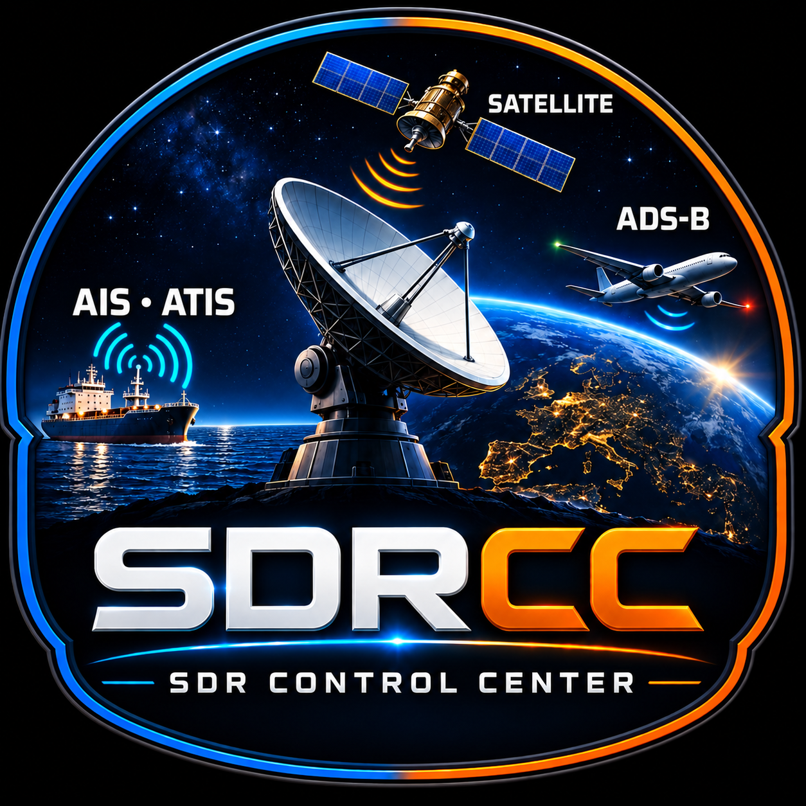
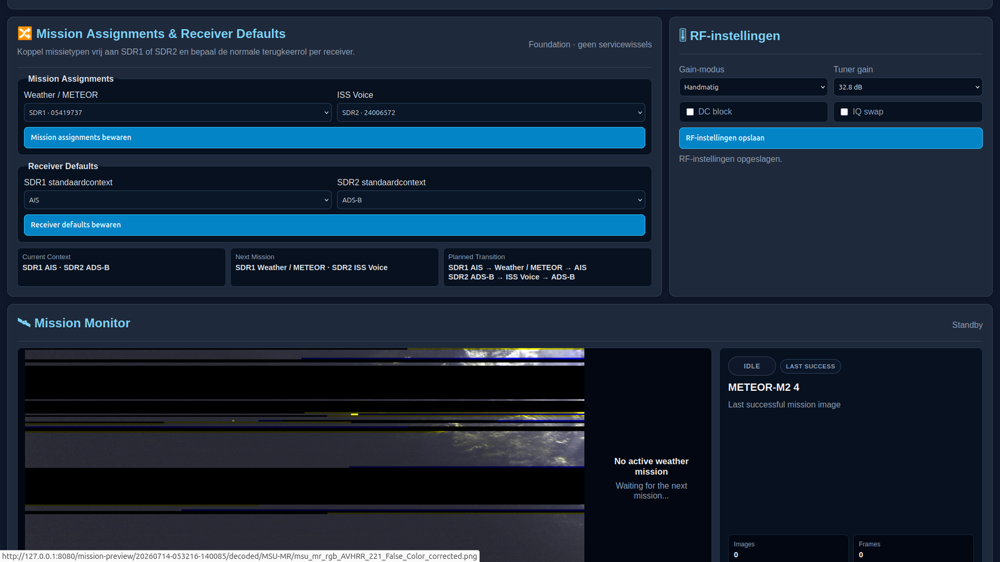
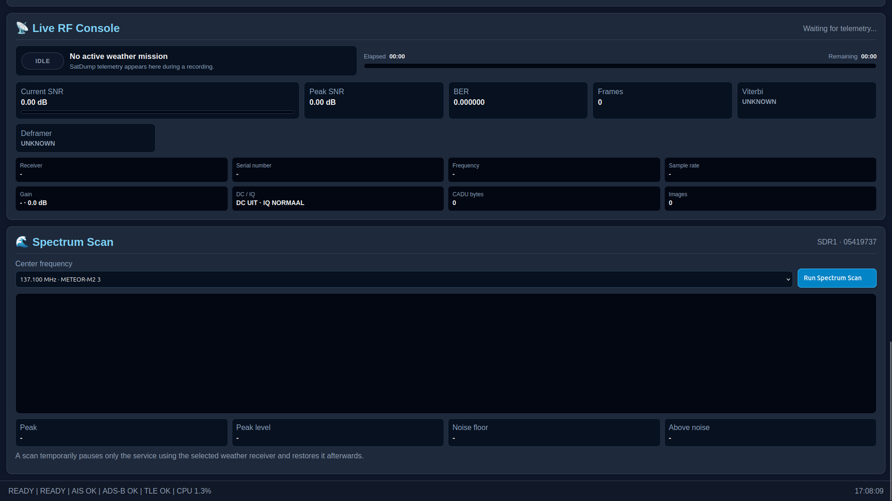
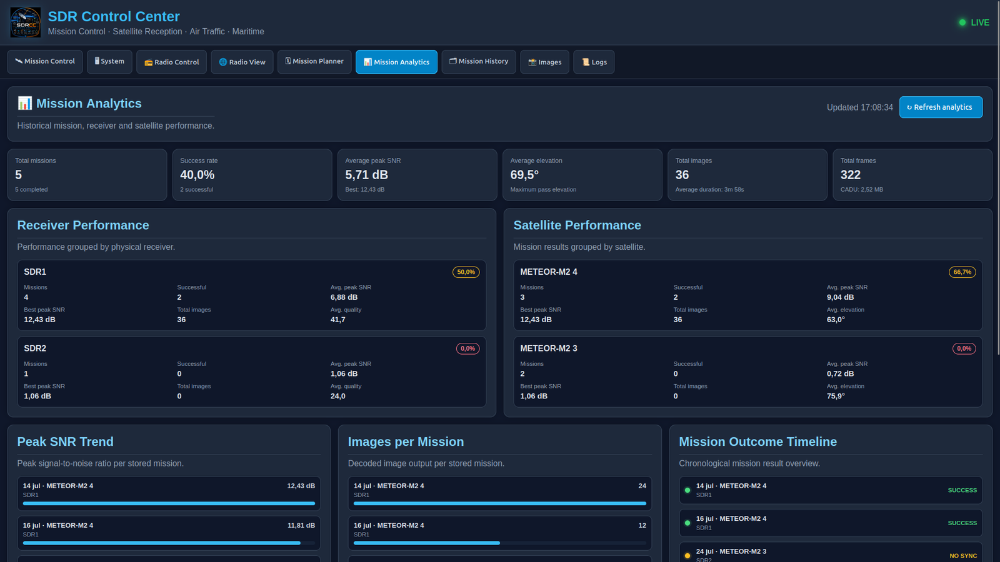
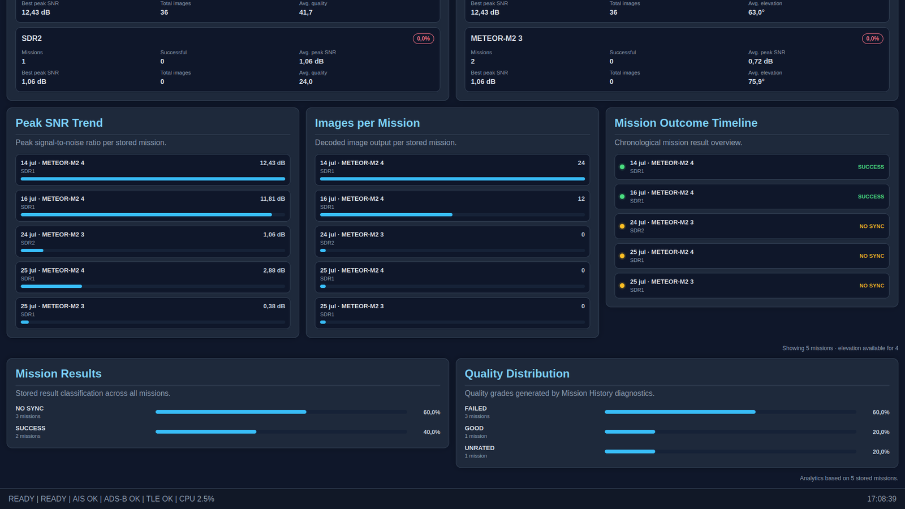
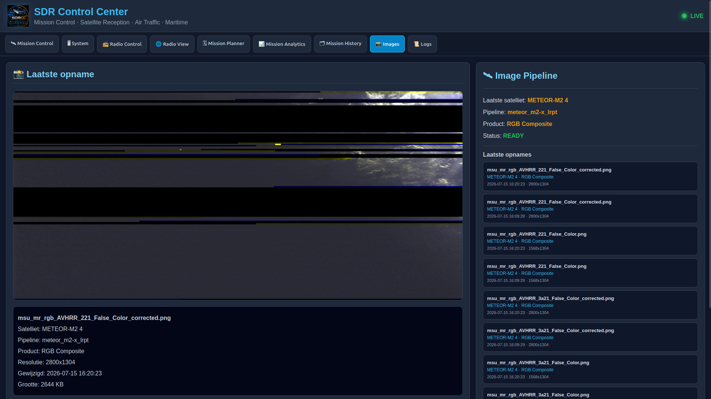
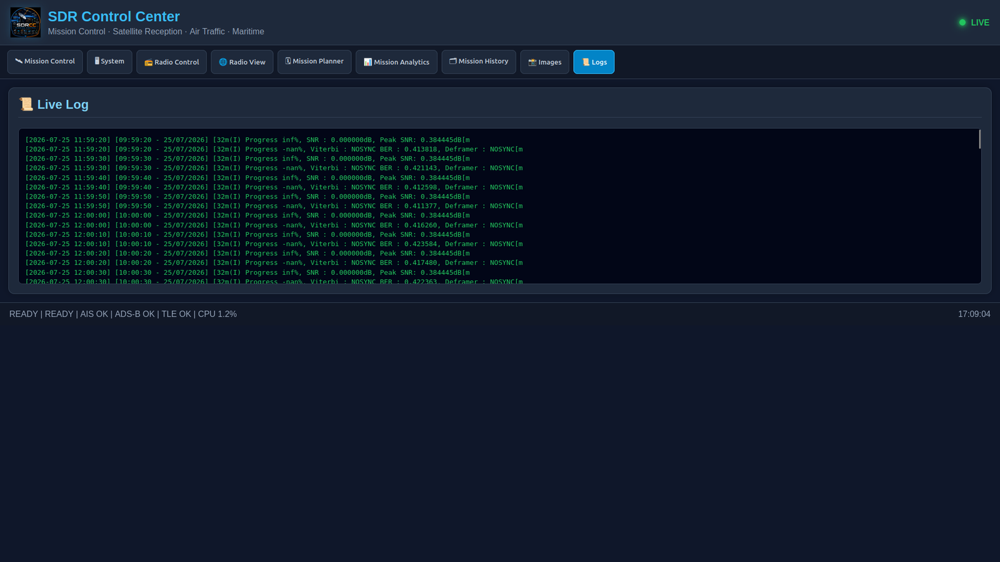

<p align="center">
  
</p>

<h1 align="center">SDR Control Center</h1>

<p align="center">
  Flexibel lokaal groundstation voor satellietontvangst, AIS, ADS-B en geautomatiseerde SDR-missies.
</p>

<p align="center">
  <strong>Ontwikkelstatus: v0.55.x</strong><br>
  Ubuntu 26.04 · Python 3.14 · Flask · RTL-SDR · SatDump · AIS-catcher · readsb
</p>

<p align="center">
  
</p>

## Over SDRCC

**SDR Control Center (SDRCC)** brengt twee fysieke SDR-ontvangers, meerdere radiodiensten en geplande missies samen in één lokaal dashboard. De software plant passages, wijst iedere missie toe aan de juiste receiver, bewaakt de runtime, registreert lifecycle-events en herstelt na afloop de normale receivertaak.

De huidige opstelling gebruikt:

| Receiver | Serienummer | Standaardcontext | Missierol |
|---|---:|---|---|
| SDR1 | `05419737` | AIS | Weather / METEOR LRPT |
| SDR2 | `24006572` | ADS-B | ISS Voice |

Receiver-toewijzingen en standaardcontexten zijn via **Radio Control** instelbaar. De **Mission Queue** blijft daarbij de centrale bron voor de geplande missie per receiver.

## Belangrijkste functies

- Dual-SDR architectuur met receiver-specifieke planning en status.
- Mission Queue, Mission Planner en configureerbare minimale elevatie.
- Mission Scheduler met `AUTO`, `MANUAL` en `PAUSED`.
- METEOR-M2 3 en METEOR-M2 4 LRPT-ontvangst via SatDump.
- ISS Voice-planning en controlled wideband-IQ capture op de toegewezen SDR.
- Receiver Manager met reservering, context, service-observatie en hersteldoel.
- Live Event Timeline en read-only Execution Journal.
- AIS- en ADS-B-monitoring met live statistieken en ingebedde viewers.
- Uitvoerbare Traffic Voice Monitor voor Marine Voice + AIS en Airband Voice + ADS-B, met dynamische receiverkeuze, lokale live-audio, kanaalactiviteit en passieve Marine ATIS-identificatie.
- Live RF Console, decodertelemetrie en idle Spectrum Scan.
- Mission History, Mission Analytics, image pipeline en live logging.
- Handmatige serviceregeling en veilige missiehulpmiddelen op het tabblad **System**.

## Dashboard

### Mission Control

De operationele cockpit toont de Mission Queue, de eerstvolgende missie per receiver, schedulerbediening, Live Event Timeline en Execution Journal.


### System

Systeemstatus, handmatige bediening van de continue AIS- en ADS-B-services, TLE-beheer, simulatie en gecontroleerd missieherstel.


### Radio Control

Live status van beide SDR's, Receiver Monitor, read-only Receiver Runtime Diagnostics, vrije mission assignments, receiver defaults en RF-instellingen.

<table>
  <tr>
    <td width="50%"></td>
    <td width="50%"></td>
  </tr>
</table>

### Live RF en Spectrum Scan

Tijdens Weather-opnames toont de Live RF Console decodertelemetrie. Wanneer de receiver vrij is kan een korte spectrumscan worden uitgevoerd.



> Dezelfde RTL-SDR kan niet tegelijk door SatDump en een losse spectrumtool worden geopend. Spectrum Scan is daarom een korte idle-meting; tijdens een missie gebruikt SDRCC de beschikbare SatDump-telemetrie.

### Radio View

Gezamenlijk overzicht van ADS-B, AIS en de eerstvolgende satellietpassage.


### Traffic Voice Monitor

**Marine Voice + AIS** en **Airband Voice + ADS-B** zijn uitvoerbaar. SDRCC leidt de voice-receiver bij iedere start af als de receiver tegenover de actuele AIS- of ADS-B-toewijzing en schakelt NFM/AM via dezelfde gepinde RTLSDR-Airband-backend. Een directe moduswissel is transactioneel; `Stop Voice` herstelt daarna nog steeds de servicestatus en Traffic Voice-assignment van vóór de eerste start. De pagina biedt live PCM-audio, vaste kanaalkeuze en kanaalscanning zonder een tweede SDR-eigenaar. Een begrensde observer decodeert geldige Marine ATIS-bursts uit een kopie van dezelfde audiobridge en toont de laatst gevalideerde roepletters bij `Possible speaker`; AIS-koppeling en kaartmarkering blijven een afzonderlijke vervolgstap.

### Mission Planner

De planner combineert pass prediction, minimale elevatie, receiver assignment, conflictcontrole en de uiteindelijke planningbeslissing.


### Mission Analytics

Historische prestaties per receiver en satelliet, inclusief succesratio, peak-SNR, beelden, resultaten en kwaliteitsverdeling.

<table>
  <tr>
    <td width="50%"></td>
    <td width="50%"></td>
  </tr>
</table>

### Mission History

Blijvend overzicht van afgeronde, mislukte en geannuleerde missies met kwaliteitsdiagnose, missiegegevens, bestanden en telemetrie.


### Images

De nieuwste succesvolle ontvangst en de beschikbare producten uit de image pipeline.



### Logs

Live applicatielog voor scheduler-, receiver-, SatDump- en missieactiviteiten.



## Architectuur

```text
Pass Prediction / Planning Policy
              ↓
         Mission Planner
              ↓
          Mission Queue
              ↓
     Automation / Scheduler
              ↓
        Mission Engine
              ↓
 Receiver Manager + Execution Plan
              ↓
 SatDump / Service Delegation / Capture
              ↓
 History · Analytics · Images · Journal
```

Belangrijke uitgangspunten:

- **Mission Queue** is de bron voor komende receiver-specifieke missies.
- **Receiver Manager** blijft autoriteit voor receiverstatus en reservering.
- **Execution Journal** observeert de lifecycle en neemt geen operationele autoriteit over.
- Bestaande servicepaden worden hergebruikt; er is geen tweede servicecontroller.
- Plugins en execution plans blijven fail-closed wanneer uitvoering niet expliciet ondersteund is.

## Missieverloop

| Moment | Actie |
|---|---|
| T-5 minuten | Preflight en policycontrole |
| T-90 seconden | Receiver en afhankelijkheden voorbereiden |
| T-30 seconden | Receiver reserveren en missiecontext vastleggen |
| T-0 | Capture- of decoderproces starten |
| Tijdens passage | Live status, events en telemetrie bijwerken |
| Na LOS | Proces afronden, resultaat classificeren en archiveren |
| Afronding | Receiver vrijgeven en standaardcontext herstellen |

## Belangrijke services

| Service | Functie |
|---|---|
| `sdrcc.service` | Flask-dashboard en SDRCC-runtime |
| `ais-catcher.service` | Continue AIS-ontvangst |
| `ais-catcher-control.service` | Bestaand gecontroleerd AIS-servicepad |
| `readsb.service` | Continue ADS-B-ontvangst |
| `sdrcc-traffic-voice.service` | Geselecteerde Marine NFM- of Airband AM-ontvangst |

Status controleren:

```bash
systemctl status sdrcc.service --no-pager -l
systemctl status ais-catcher.service --no-pager -l
systemctl status readsb.service --no-pager -l
systemctl status sdrcc-traffic-voice.service --no-pager -l
```

## Dashboard starten

SDRCC draait standaard lokaal op:

```text
http://127.0.0.1:8080
```

Herstarten en controleren:

```bash
sudo systemctl restart sdrcc.service
systemctl status sdrcc.service --no-pager -l
curl -sS -o /dev/null -w '%{http_code}\n' http://127.0.0.1:8080/api/status
```

## Belangrijkste API-endpoints

| Endpoint | Functie |
|---|---|
| `GET /api/status` | Algemene systeemstatus |
| `GET /api/mission-operations` | Samengevoegde operationele status |
| `GET /api/mission-queue` | Receiver-specifieke geplande missies |
| `GET /api/mission-engine` | Mission Engine-status |
| `GET /api/mission-scheduler` | Schedulerstatus en modus |
| `GET /api/automation-controller` | Automationstatus |
| `GET /api/receiver-contexts` | Toewijzingen en standaardcontexten |
| `GET /api/receiver-runtime` | Read-only receiver-runtime |
| `GET /api/receiver-monitor` | AIS-, ADS-B- en missiestatistieken |
| `GET /api/traffic-voice` | Traffic Voice-configuratie, receiverprojectie en live status |
| `POST /api/traffic-voice/action` | Begrensde Start, Switch, Stop en receiverinstellingen |
| `GET /api/live-rf` | Live decoder- en RF-telemetrie |
| `GET /api/execution-journal` | Read-only execution lifecycle |
| `GET /api/mission-history` | Opgeslagen missies en resultaten |
| `GET /api/capture-status` | Laatste beschikbare beeldproduct |

## Projectstructuur

```text
SDRCC/
├── config/                     # Station-, receiver- en satellietconfiguratie
├── core/                       # Planning, runtime, receivers en execution
├── dashboard/                  # Flask API en webinterface
├── data/                       # TLE, state, recordings en resultaten
├── docs/                       # Architectuur- en release-documentatie
│   └── screenshots/            # README-afbeeldingen
├── scripts/                    # CLI, validators en hulpmiddelen
├── README.md
└── VERSION
```

## Ontwikkeling

De actieve ontwikkelbranch is:

```text
develop
```

SDRCC wordt in kleine, controleerbare releases ontwikkeld. Iedere wijziging wordt eerst geanalyseerd, daarna als compleet installatiepakket geleverd en gevalideerd. Operationele wijzigingen worden pas gecommit nadat idle-tests en relevante echte missies zijn beoordeeld.

Controle vóór een commit:

```bash
git status
git diff --check
python3 -m compileall -q core dashboard scripts
```

## Status

SDRCC is actief in ontwikkeling. De huidige v0.55.x-lijn bouwt de Traffic Voice Monitor gecontroleerd op bovenop de bestaande receiver-, plugin- en handoverautoriteit.
