# SDRCC Data Flow

**Project:** SDR Control Center (SDRCC)  
**Documentversie:** v0.35.1d  
**Status:** Architectuurreferentie  
**Doel:** Vastleggen hoe opdrachten, status, telemetrie en resultaten door SDRCC bewegen.

---

## 1. Doel

Dit document beschrijft de belangrijkste gegevensstromen binnen SDRCC.

De nadruk ligt op:

- welke module gegevens produceert;
- welke module gegevens gebruikt;
- welke module eigenaar blijft;
- hoe opdrachten door het systeem lopen;
- hoe actieve state wordt gescheiden van historische data;
- hoe Receiver Runtime later wordt ingevoegd zonder dubbele logica.

De hoofdregel is:

> Data mag door meerdere modules worden gelezen, maar blijft eigendom van één gezaghebbende bron.

---

## 2. Hoofdstromen

SDRCC kent vijf primaire gegevensstromen:

1. Planning
2. Missie-uitvoering
3. Receiver runtime
4. Telemetrie en events
5. Resultaten en history

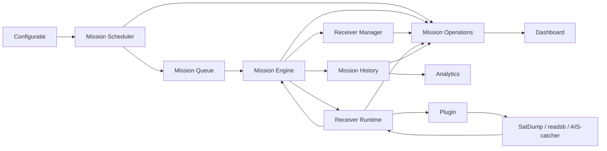

---

## 3. Configuratiestroom

Configuratie is de basis voor planning en uitvoering.

Belangrijke configuratiebronnen:

- `config/station.yaml`
- `config/satellites.yaml`
- `config/profiles.yaml`
- overige plugin- of receiverconfiguratie

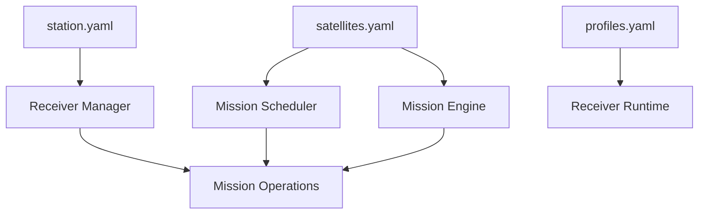

### Regels

- Receiver Manager is eigenaar van receiverconfiguratie.
- Mission Scheduler leest satelliet- en planningsgegevens.
- Mission Engine gebruikt de vastgestelde uitvoeringscontext.
- Plugins krijgen alleen de configuratie die voor hun job nodig is.
- De frontend schrijft configuratie uitsluitend via een backend-API.
- JavaScript is nooit de gezaghebbende configuratiebron.

---

## 4. Planning naar mission queue

Mission Scheduler berekent of ontvangt toekomstige missies en plaatst deze in de mission queue.

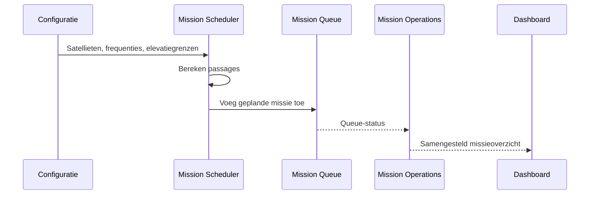

### Queue-item bevat minimaal

- mission id;
- satellite of job type;
- starttijd;
- eindtijd;
- maximum elevatie;
- frequentie;
- mode;
- pipeline;
- gewenste receiver of selectiecriteria;
- planningsstatus.

### Ownership

Mission Scheduler blijft eigenaar van queue-items zolang de missie nog niet voor uitvoering is overgedragen.

---

## 5. Overdracht van Scheduler naar Mission Engine

Wanneer een geplande missie uitvoerbaar wordt, maakt Mission Scheduler een uitvoeringsaanvraag.

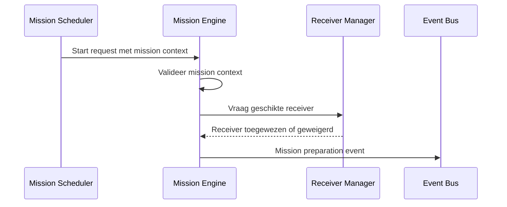

### Belangrijke regel

De Scheduler start geen hardwareproces.

De Scheduler levert uitsluitend een complete mission context aan Mission Engine.

---

## 6. Mission context

Mission Engine gebruikt één samengestelde mission context als basis voor uitvoering.

Voorbeeldvelden:

```text
mission_id
job_type
satellite
start_time
end_time
frequency_hz
mode
pipeline
receiver_id
receiver_serial
gain
sample_rate
output_directory
plugin_name
```

### Regels

- De context wordt één keer samengesteld voordat uitvoering begint.
- Plugins wijzigen de oorspronkelijke mission context niet.
- Runtimegegevens worden apart bijgehouden.
- Historische metadata wordt pas na afronding definitief opgeslagen.
- Frequentie en pipeline komen uit backendconfiguratie, niet uit frontendlabels.

---

## 7. Receiverselectie en reservering

Receiver Manager bepaalt welke receiver beschikbaar en geschikt is.

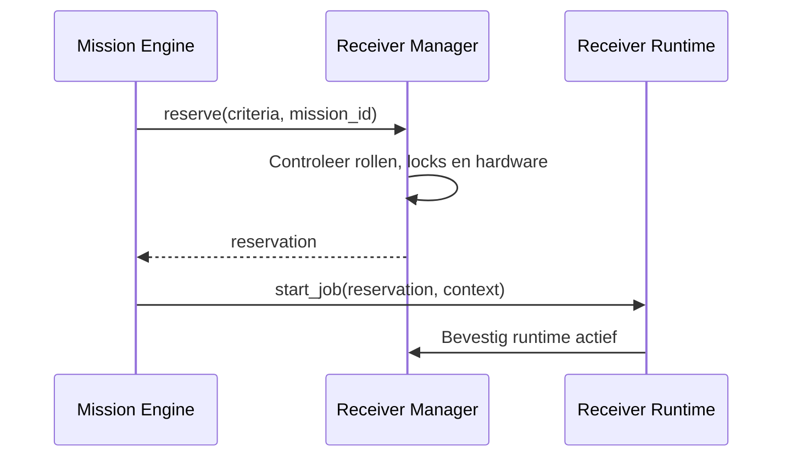

### Selectiecriteria kunnen bevatten

- vaste receiver;
- vereiste rol;
- ondersteunde frequentie;
- beschikbare driver;
- actieve serviceconflicten;
- hardwarestatus;
- prioriteit.

### Regels

- Alleen Receiver Manager reserveert receivers.
- Receiver Runtime gebruikt uitsluitend een geldige reservering.
- Plugins mogen geen receiver omwisselen.
- Een fallback naar een andere receiver moet expliciet door Receiver Manager worden besloten.

---

## 8. Receiver Runtime en pluginuitvoering

Receiver Runtime wordt de uitvoeringslaag per receiver.

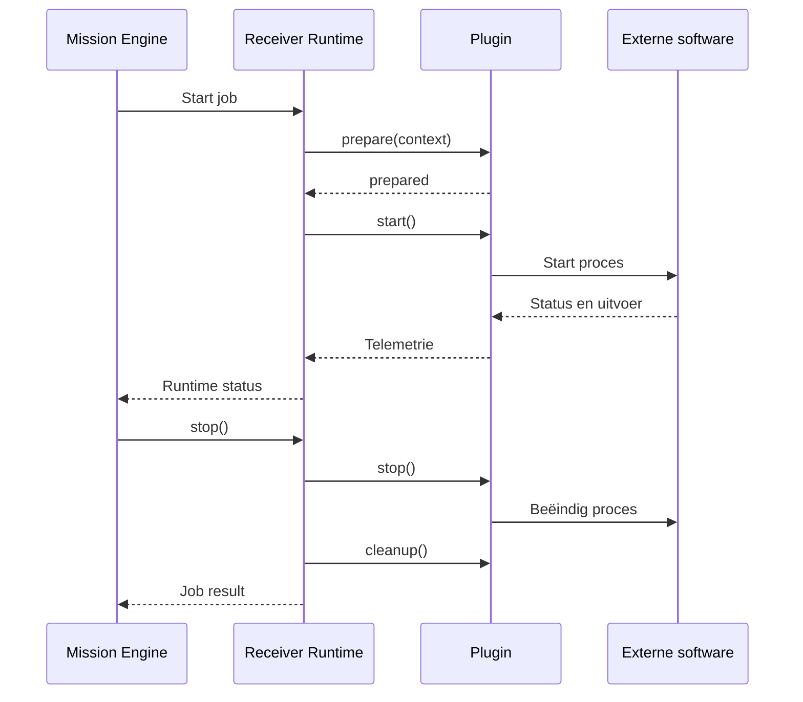

### Runtimegegevens

Receiver Runtime beheert onder andere:

```text
receiver_id
active_job
plugin_name
process_id
started_at
runtime_state
last_error
stop_requested
cleanup_state
```

### Regels

- `active_job` hoort uiteindelijk bij Receiver Runtime.
- Receiver Manager blijft tijdens migratie de publieke compatibiliteitsbron.
- Runtime state wordt niet als Mission History opgeslagen.
- Alleen definitieve resultaten gaan naar Mission Engine.

---

## 9. SatDump-stroom

Voor METEOR-missies loopt de concrete uitvoering via een SatDump-plugin of adapter.

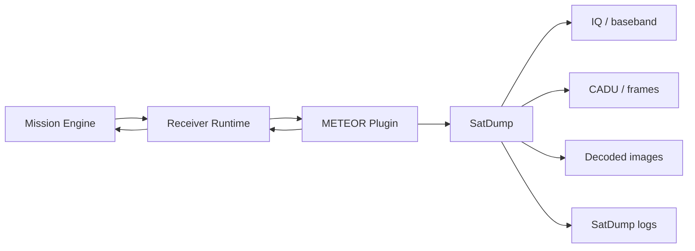

### Invoer naar SatDump

- receiver device of serial;
- frequency;
- sample rate;
- gain;
- pipeline;
- output directory;
- verwachte duur.

### Uitvoer vanuit SatDump

- return code;
- process output;
- decoded files;
- images;
- frame- en CADU-informatie;
- synchronisatiestatus;
- fouten.

### Regels

- Return code alleen is niet voldoende om succes te bepalen.
- Mission Engine bepaalt het uiteindelijke missieresultaat.
- Geen sync, ontbrekende beelden en decodefouten worden expliciet vastgelegd.
- SatDump-specifieke logica blijft buiten Mission Scheduler en Dashboard.

---

## 10. Telemetriestroom

Actieve telemetrie wordt geproduceerd door plugins, Receiver Runtime en Mission Engine.

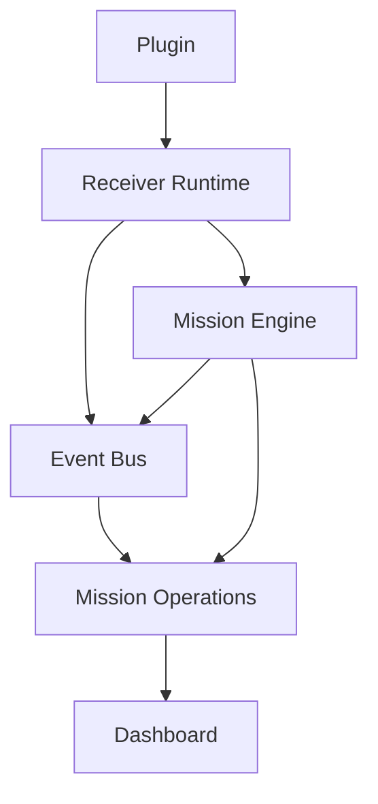

### Voorbeelden

- actuele frequentie;
- gain;
- signaalniveau;
- noise floor;
- SNR;
- frames;
- CADU;
- beeldenteller;
- resterende tijd;
- processtatus;
- lockstatus.

### Regels

- Telemetrie is vluchtig.
- Mission Operations mag telemetrie samenvoegen, maar niet als nieuwe autoriteit opslaan.
- Het dashboard toont de laatst bekende backendwaarde.
- Alleen geselecteerde eindwaarden worden later naar History geschreven.

---

## 11. Event Bus-stroom

De Event Bus verspreidt gebeurtenissen tussen backendmodules.

Eventcategorieën:

- SYSTEM
- SCHEDULER
- PREFLIGHT
- MISSION
- RECEIVER
- SATDUMP
- TELEMETRY

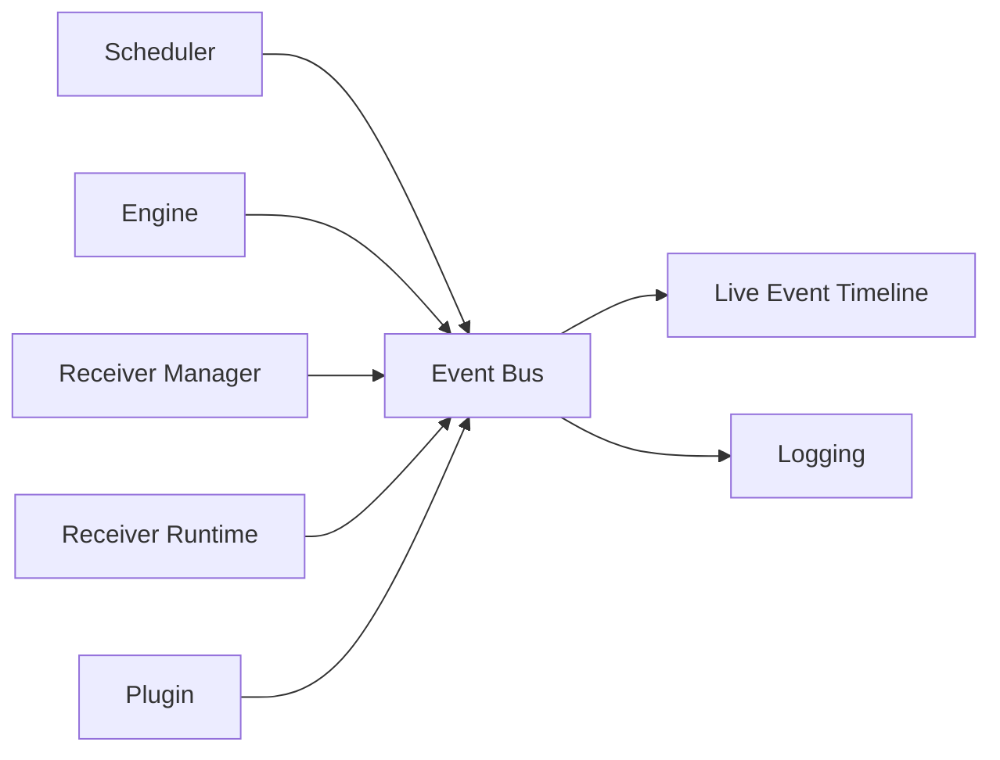

### Event bevat minimaal

```text
timestamp
category
source
event_type
message
severity
mission_id
receiver_id
metadata
```

### Regels

- Events melden wat is gebeurd.
- Events zijn geen vervanging voor actuele state.
- Consumers mogen een gemist event niet interpreteren als bewijs dat state niet bestaat.
- Recovery na restart gebruikt state-opslag, niet uitsluitend de Event Bus.

---

## 12. Mission Operations naar Dashboard

Mission Operations biedt een samengestelde operationele response.

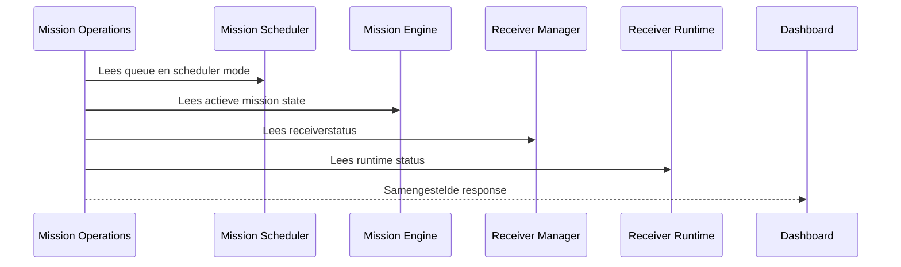

### Doel

De frontend hoeft niet zelf te bepalen hoe verschillende backendresponses bij elkaar horen.

### Regels

- Mission Operations verandert geen ownership.
- Iedere bron blijft verantwoordelijk voor eigen state.
- Ontbrekende brondata wordt als unavailable of unknown gemarkeerd.
- De frontend mag geen status reconstrueren uit labels of kleuren.

---

## 13. Afronding van een missie

Na opname en verwerking levert Receiver Runtime een jobresultaat terug aan Mission Engine.

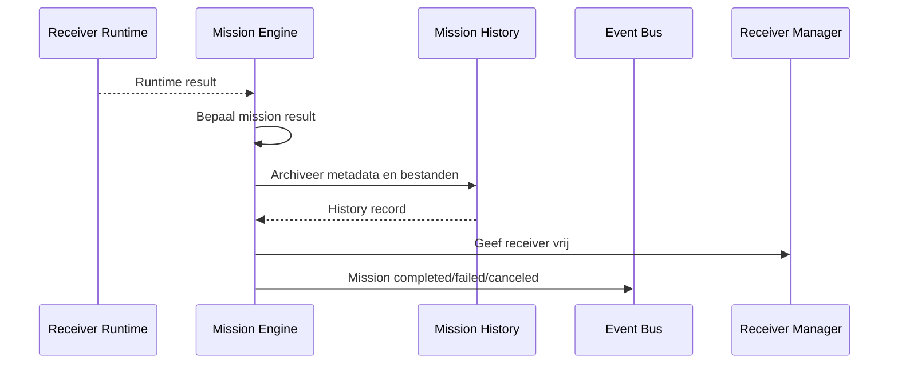

### Mogelijke resultaten

- completed;
- completed_with_warnings;
- failed;
- canceled;
- aborted;
- no_sync;
- no_images.

De precieze resultaatset moet centraal worden vastgelegd en niet per frontendpagina verschillen.

---

## 14. Mission History-stroom

Mission History ontvangt uitsluitend afgeronde of definitief afgebroken missies.

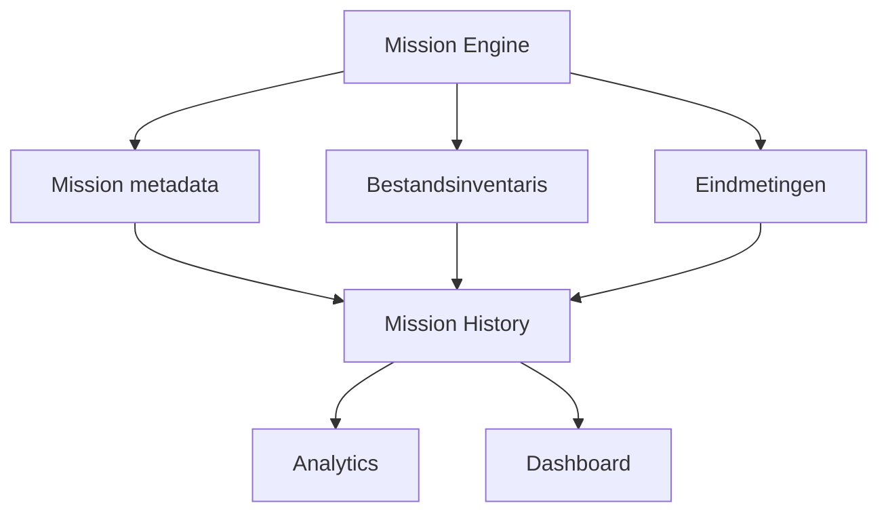

### Historisch record bevat bijvoorbeeld

```text
mission_id
satellite
receiver
frequency_hz
start_time
end_time
duration
result
peak_snr_db
average_snr_db
frames
cadu_bytes
image_count
recording_files
image_files
log_files
errors
```

### Regels

- History is append/finalize-georiënteerd.
- Actieve missiestatus blijft bij Mission Engine.
- Verwijderen gebeurt per complete missie.
- Bestandsinventaris en metadata moeten consistent blijven.

---

## 15. Foutstroom

Fouten moeten teruglopen naar de module die de eindbeslissing neemt.

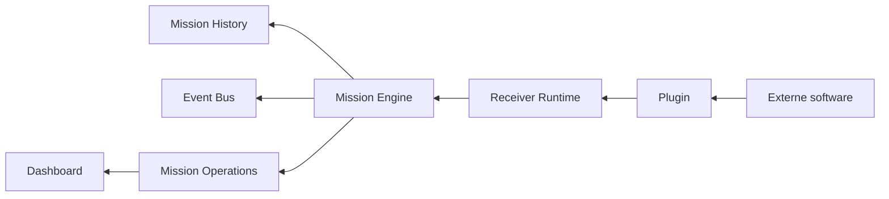

### Voorbeelden

- receiver niet beschikbaar;
- proces start niet;
- SatDump return code ongelijk aan nul;
- geen synchronisatie;
- geen uitvoerbestanden;
- cleanup mislukt;
- serviceconflict;
- timeout.

### Regels

- Fouten worden niet stil genegeerd.
- De laag die de fout detecteert levert technische details.
- Mission Engine bepaalt het missie-effect.
- History bewaart de uiteindelijke foutcontext.
- Dashboard toont een begrijpelijke samenvatting.

---

## 16. Stop Mission-stroom

Een stopactie vanuit het dashboard loopt via backendowners.

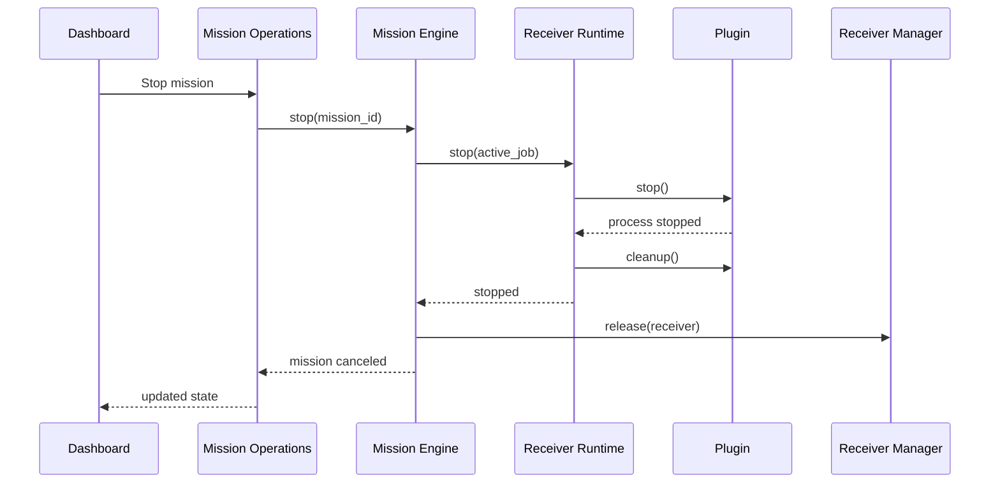

De frontend stopt nooit rechtstreeks een proces of service.

---

## 17. Frequentiewijziging

Een handmatige frequentiewijziging moet via een configuratie-API lopen.

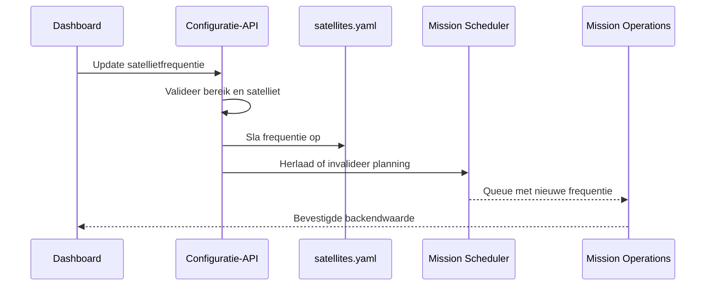

### Regels

- Frequenties worden in Hz opgeslagen.
- De backend valideert minimum, maximum en datatype.
- Queue, missiekaart en uitvoering gebruiken dezelfde configuratiebron.
- Bestaande actieve missies veranderen niet stil tijdens uitvoering.
- Een wijziging geldt voor nieuw geplande missies tenzij expliciet anders ontworpen.

---

## 18. API-responsregels

Iedere operationele API-response gebruikt waar mogelijk:

```text
status
data
error
updated_at
source
```

### Regels

- Tijden worden eenduidig weergegeven.
- Frequenties worden intern in Hz opgeslagen.
- Frontendformattering naar MHz verandert de bronwaarde niet.
- Onbekende state wordt niet als idle gepresenteerd.
- Fouten bevatten een stabiele code en leesbare melding.
- Bestaande velden blijven tijdens migraties behouden.

---

## 19. Migratie naar Receiver Runtime

De migratie verloopt in vier gegevensstappen.

### Fase 1 — Observeren

Receiver Runtime leest bestaande receiver- en mission state zonder eigenaar te zijn.

### Fase 2 — Spiegeling

Runtimegegevens worden naast bestaande responses gepubliceerd voor vergelijking.

### Fase 3 — Uitvoering

Receiver Runtime beheert pluginprocessen, terwijl Receiver Manager reserveringen blijft beheren.

### Fase 4 — Autoriteit

`active_job` en runtime state worden officieel eigendom van Receiver Runtime. Receiver Manager biedt zo nodig compatibiliteitsvelden.

### Hoofdregel

Er mag tijdens geen enkele fase onduidelijkheid bestaan over welke bron gezaghebbend is.

---

## 20. Samenvatting

De belangrijkste SDRCC-gegevensstroom is:

```text
Configuratie
    ↓
Mission Scheduler
    ↓
Mission Queue
    ↓
Mission Engine
    ↓
Receiver Manager
    ↓
Receiver Runtime
    ↓
Plugin
    ↓
Externe software
    ↓
Receiver Runtime
    ↓
Mission Engine
    ↓
Mission History
    ↓
Analytics en Dashboard
```

Mission Operations verzamelt actuele gegevens voor de frontend, maar neemt het eigenaarschap van de bronmodules niet over.

Deze datastromen zijn leidend voor verdere implementatie vanaf v0.35.
