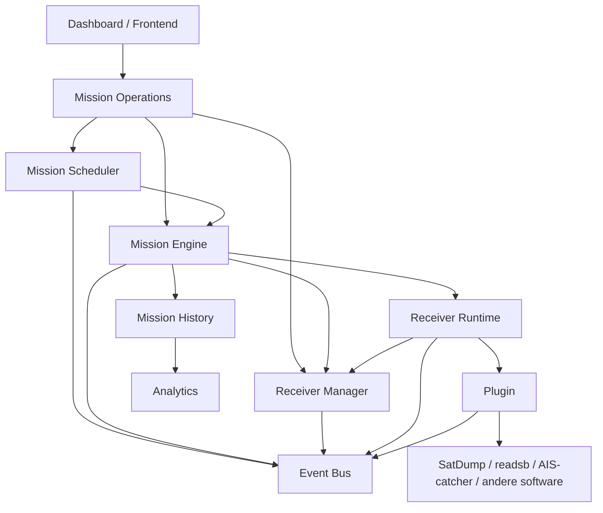

# SDRCC Ownership Matrix

**Project:** SDR Control Center (SDRCC)  
**Documentversie:** v0.35.1b  
**Status:** Architectuurreferentie  
**Doel:** Vastleggen welke module eigenaar is van welke verantwoordelijkheid, status en gegevensstroom.

---

## 1. Waarom deze matrix bestaat

SDRCC bestaat uit meerdere samenwerkende modules. Zonder duidelijke grenzen kunnen twee modules dezelfde status beheren, dezelfde beslissing nemen of dezelfde hardware aansturen.

Deze ownership matrix voorkomt dat door voor iedere verantwoordelijkheid één primaire eigenaar vast te leggen.

De hoofdregel is:

> Iedere status, beslissing en hardwareactie heeft precies één eigenaar.

Andere modules mogen gegevens lezen, aanvragen doen of gebeurtenissen publiceren, maar nemen het eigenaarschap niet over.

---

## 2. Kernbegrippen

### Owner

De module die de autoriteit heeft over een verantwoordelijkheid of status.

Alleen de owner mag de definitieve toestand wijzigen.

### Consumer

Een module die gegevens van de owner leest of gebruikt.

Een consumer mag geen eigen concurrerende waarheid bijhouden.

### Orchestrator

Een module die meerdere owners aanroept om een proces uit te voeren, zonder zelf eigenaar te worden van hun interne state.

### Adapter

Een module die SDRCC koppelt aan externe software, hardware of services.

Een adapter vertaalt opdrachten en resultaten, maar bepaalt niet zelfstandig de missie- of receiverstatus.

---

## 3. Hoofdverantwoordelijkheden

| Verantwoordelijkheid | Primaire eigenaar | Lezers / gebruikers | Niet toegestaan |
|---|---|---|---|
| Mission Operations-overzicht | Mission Operations | Dashboard | Eigen receiver- of mission-state creëren |
| Missieplanning | Mission Scheduler | Mission Operations, Dashboard | Missies uitvoeren of receivers direct bedienen |
| Missiewachtrij | Mission Scheduler | Mission Operations, Dashboard | Parallelle wachtrij in frontend of Mission Engine |
| Actieve missiestatus | Mission Engine | Mission Operations, Dashboard, History | Dezelfde lifecycle in Scheduler of frontend beheren |
| Missie-uitvoering | Mission Engine | Mission Operations | Scheduler of Dashboard processen laten starten |
| Receiverinventaris | Receiver Manager | Mission Engine, Mission Operations, Dashboard | Receiverlijst dupliceren in andere modules |
| Receiverconfiguratie | Receiver Manager | Mission Engine, Receiver Runtime | Plugins direct configuratiebestanden laten herschrijven |
| Receiverreservering | Receiver Manager | Mission Engine, Receiver Runtime | Zelfstandige locks in plugins of frontend |
| Receiver runtime-state | Receiver Runtime | Receiver Manager, Mission Engine, Mission Operations | `active_job` in meerdere modules tegelijk beheren |
| Plugin lifecycle | Receiver Runtime | Mission Engine, Mission Operations | Mission Engine plugins intern laten aansturen |
| Hardwareproces | Plugin / adapter onder Receiver Runtime | Receiver Runtime | Dashboard of Scheduler subprocessen laten starten |
| SatDump-integratie | SatDump-adapter / METEOR-plugin | Receiver Runtime, Mission Engine | SatDump-logica verspreiden over meerdere modules |
| Mission History | Mission History | Dashboard, Analytics, Mission Operations | Historische records als actieve state gebruiken |
| Mission Analytics | Analytics | Dashboard, Mission History | Actieve missie beslissingen nemen |
| Gebeurtenissen | Event Bus | Alle backendmodules | Event Bus als state-database gebruiken |
| API-presentatie | Dashboard API-laag | Frontend | Bedrijfslogica in JavaScript plaatsen |
| Frontendweergave | Dashboard frontend | Gebruiker | Eigen backendstatus afleiden of overschrijven |

---

## 4. Modulegrenzen

## 4.1 Mission Operations

### Is eigenaar van

- Het samengestelde operationele overzicht voor het dashboard.
- De presentatie van actuele gegevens uit Scheduler, Mission Engine en Receiver Manager.
- Orkestratie van gebruikersacties die meerdere backendmodules raken.
- Normalisatie van operationele API-responses.

### Is geen eigenaar van

- Missieplanning.
- Actieve missiestatus.
- Receiverstatus.
- Receiverlocks.
- Pluginprocessen.
- Historische missiegegevens.

### Toegestane acties

- Status ophalen bij de verantwoordelijke owners.
- Een missieactie aanvragen bij Mission Engine.
- Een planningsactie aanvragen bij Mission Scheduler.
- Een receiveractie aanvragen bij Receiver Manager.
- Samengestelde gegevens aanbieden via één API.

### Niet toegestaan

- Een tweede mission state machine introduceren.
- Receiverbeschikbaarheid zelfstandig berekenen.
- Hardwareprocessen starten of stoppen.
- Een eigen kopie van `active_job` als autoriteit gebruiken.

---

## 4.2 Mission Scheduler

### Is eigenaar van

- Toekomstige missies.
- De mission queue.
- Selectie van geplande passages.
- Startmomenten en planningsregels.
- Scheduler mode: AUTO, MANUAL of PAUSED.
- Overgang van gepland werk naar een uitvoeringsaanvraag.

### Is geen eigenaar van

- De uitvoering van een missie.
- Receiverlocks.
- SatDump-processen.
- Actieve opname- of decode-state.
- Mission History.

### Toegestane acties

- Passages berekenen.
- Missies toevoegen, bijwerken en verwijderen uit de wachtrij.
- Op het juiste moment een uitvoeringsaanvraag indienen.
- Controleren of uitvoering beleidsmatig mag beginnen.

### Niet toegestaan

- Een receiver direct claimen.
- SatDump starten.
- Een missie als succesvol afronden.
- De actieve mission lifecycle dupliceren.

---

## 4.3 Mission Engine

### Is eigenaar van

- De actieve mission lifecycle.
- De overgang tussen missie-fasen.
- Uitvoeringscoördinatie.
- Missieresultaat: completed, failed, canceled of aborted.
- Opdrachtverlening aan Receiver Manager en Receiver Runtime.
- Het verzamelen van uitvoeringsresultaten voor archivering.

### Is geen eigenaar van

- De receiverinventaris.
- Permanente receiverconfiguratie.
- De interne lifecycle van plugins.
- De mission queue.
- Dashboardweergave.

### Toegestane acties

- Een receiverreservering aanvragen.
- Receiver Runtime opdracht geven een plugin uit te voeren.
- Missiefasen bijwerken.
- Fouten verwerken en een missie gecontroleerd beëindigen.
- Resultaten doorgeven aan Mission History.

### Niet toegestaan

- Zelf USB-devices ontdekken.
- Parallelle receiverlocks bijhouden.
- Pluginspecifieke uitvoering in de engine opnemen.
- Schedulerstate beheren.

---

## 4.4 Receiver Manager

### Is eigenaar van

- Bekende receivers en hun identiteit.
- Serienummers en hardwarekoppeling.
- Receiverrollen en configuratie.
- Beschikbaarheid.
- Reserveringen en vrijgave.
- De gezaghebbende receiverstatus tijdens de migratiefase.
- Compatibiliteit met bestaande receiver-API's.

### Is geen eigenaar van

- Missieplanning.
- De volledige mission lifecycle.
- Pluginspecifieke verwerking.
- Mission History.
- Frontendpresentatie.

### Toegestane acties

- Receivers registreren en valideren.
- Een receiver reserveren voor een eigenaar of job.
- Configuratie beschikbaar stellen.
- Receiverstatus publiceren.
- Een receiver gecontroleerd vrijgeven.

### Niet toegestaan

- Zelf satellietmissies plannen.
- Missies als completed markeren.
- Pluginspecifieke decodebeslissingen nemen.
- Meerdere concurrerende lockmechanismen toestaan.

---

## 4.5 Receiver Runtime

Receiver Runtime wordt gefaseerd ingevoerd. Tijdens de migratie blijft Receiver Manager de gezaghebbende bron voor bestaande receiverstate.

### Wordt eigenaar van

- De runtime-uitvoering per receiver.
- `active_job` per receiver.
- De actieve plugininstantie.
- Plugin lifecycle.
- Procesbewaking.
- Runtimefouten en gecontroleerde cleanup.
- Pauzeren, hervatten en stoppen van ondersteunde jobs.

### Is geen eigenaar van

- Receiverinventaris.
- Permanente receiverconfiguratie.
- Missieplanning.
- Mission History.
- De algemene mission lifecycle.

### Toegestane acties

- Een door Receiver Manager gereserveerde receiver activeren.
- De juiste plugin laden.
- `prepare`, `start`, `pause`, `resume`, `stop` en `cleanup` uitvoeren.
- Runtimegegevens en fouten terugmelden.
- Na uitvoering resources vrijmaken.

### Niet toegestaan

- Zelf een vrije receiver selecteren.
- Configuratie permanent wijzigen zonder Receiver Manager.
- Een missie zelfstandig plannen.
- Een mission-resultaat buiten Mission Engine definitief vastleggen.

---

## 4.6 Plugins

### Zijn eigenaar van

- Pluginspecifieke uitvoering.
- Vertaling van generieke runtime-opdrachten naar een concrete ontvangerstaak.
- Pluginspecifieke procesparameters.
- Pluginspecifieke metingen en resultaten.
- Correct afsluiten van eigen subprocessen en tijdelijke resources.

### Zijn geen eigenaar van

- Receiverselectie.
- Receiverreservering.
- Mission queue.
- Algemene mission lifecycle.
- Permanente SDRCC-configuratie.

### Verplichte interface

```text
prepare(context)
start()
pause()
resume()
stop()
cleanup()
status()
```

Niet iedere externe toepassing ondersteunt werkelijk pauzeren of hervatten. Een plugin moet dit expliciet rapporteren en mag geen ondersteuning simuleren.

### Niet toegestaan

- Zelf een andere receiver kiezen.
- Receiverlocks omzeilen.
- Algemene dashboard-API's aanbieden.
- Eigen globale scheduler bouwen.

---

## 4.7 Mission History

### Is eigenaar van

- Afgeronde missierecords.
- Missiemetadata.
- Bestandsinventaris.
- Opnames, afbeeldingen en logs.
- Vastgelegde kwaliteitsmetingen.
- Verwijderen van complete historische missies.

### Is geen eigenaar van

- Actieve mission state.
- Receiverstatus.
- Planning.
- Runtimeprocessen.

### Hoofdregel

Mission History wordt pas autoriteit nadat uitvoeringsgegevens door Mission Engine definitief zijn aangeleverd.

Historische gegevens mogen niet worden gebruikt om actieve hardwarestate te bepalen.

---

## 4.8 Analytics

### Is eigenaar van

- Afgeleide statistieken uit historische en vastgelegde telemetrie.
- Vergelijkingen tussen missies.
- Kwaliteitssamenvattingen.
- Rapportagewaarden zoals gemiddelde SNR, peak SNR, frames, CADU en image count.

### Is geen eigenaar van

- Ruwe actieve state.
- Mission lifecycle.
- Receiverlocks.
- Procesbesturing.

---

## 4.9 Dashboard en frontend

### Zijn eigenaar van

- Presentatie.
- Gebruikersinteractie.
- Formuliervalidatie voor gebruiksgemak.
- Periodiek ophalen of ontvangen van backendupdates.
- Tonen van foutmeldingen van de backend.

### Zijn geen eigenaar van

- Bedrijfslogica.
- Mission state.
- Receiver state.
- Schedulerbeslissingen.
- Hardwarecontrole buiten gedocumenteerde API-acties.

### Hoofdregel

Wanneer frontendinformatie afwijkt van de backend, is de backend altijd leidend.

---

## 4.10 Event Bus

### Is eigenaar van

- Transport van gebeurtenissen tussen backendmodules.
- Uniforme eventcategorieën.
- Tijdstempels en eventmetadata.
- Publicatie van operationele gebeurtenissen.

### Is geen eigenaar van

- Permanente state.
- Herstel na restart.
- Mission History.
- Receiverlocks.

### Hoofdregel

Een event meldt dat iets is gebeurd. Het event is niet automatisch de actuele toestand.

---

## 5. State ownership

| State | Eigenaar | Persistente opslag | Publicatie |
|---|---|---|---|
| Scheduler mode | Mission Scheduler | Configuratie / schedulerstate | Scheduler API, Mission Operations |
| Mission queue | Mission Scheduler | Queue-opslag | Scheduler API, Mission Operations |
| Actieve mission phase | Mission Engine | Runtimestate, eventueel recovery snapshot | Mission Engine API, Mission Operations |
| Mission result | Mission Engine | Mission History | History API, Mission Operations |
| Receiver identity | Receiver Manager | Stationconfiguratie | Receiver Manager API |
| Receiver role | Receiver Manager | Stationconfiguratie | Receiver Manager API |
| Receiver reservation | Receiver Manager | Runtimestate | Receiver Manager API |
| Receiver active job | Receiver Runtime, na migratie | Runtimestate | Receiver Manager-compatibiliteitslaag, Mission Operations |
| Plugin status | Receiver Runtime / actieve plugin | Runtimestate | Runtimestatus via backend-API |
| Historische missie | Mission History | Missiondirectory en metadata | History API |
| Analytics | Analytics | Afgeleid of gecachet | Analytics/History API |
| Frontendselectie | Frontend | Alleen lokale UI-state | Niet gezaghebbend |

---

## 6. Beslissingsbevoegdheid

| Beslissing | Bevoegde module |
|---|---|
| Welke missie staat als volgende gepland? | Mission Scheduler |
| Mag de volgende geplande missie worden aangeboden voor uitvoering? | Mission Scheduler |
| Kan een missie nu technisch starten? | Mission Engine in overleg met Receiver Manager |
| Welke receiver wordt gereserveerd? | Receiver Manager |
| Welke plugin hoort bij de job? | Mission Engine bepaalt jobtype; Receiver Runtime laadt de geregistreerde plugin |
| Hoe wordt de concrete applicatie gestart? | Plugin |
| Is de missie completed, failed of canceled? | Mission Engine |
| Welke historische bestanden horen bij de missie? | Mission History |
| Welke waarden worden in het dashboard getoond? | Backendowners leveren data; Dashboard presenteert |
| Kan een actieve job veilig worden gestopt? | Receiver Runtime voert uit; Mission Engine bepaalt missiegevolg |

---

## 7. Toegestane aanroeprichting



De Event Bus is voor meldingen en observatie. Commando's die een definitieve statuswijziging veroorzaken lopen via de eigenaar van die status.

---

## 8. Verboden architectuurpatronen

De volgende patronen zijn binnen SDRCC niet toegestaan:

1. Dezelfde status in meerdere modules als autoriteit beheren.
2. Frontend-JavaScript laten bepalen of hardware actief is.
3. Plugins zelf receivers laten selecteren of reserveren.
4. Scheduler rechtstreeks SatDump of andere hardwareprocessen laten starten.
5. Mission Operations een tweede Mission Engine laten worden.
6. Event Bus gebruiken als database of lockmechanisme.
7. Historische missiedata gebruiken als actuele receiverstate.
8. Nieuwe endpoints toevoegen die bestaande ownership omzeilen.
9. Stille fallback naar een andere receiver zonder expliciete backendbeslissing.
10. Fouten verbergen door een missie toch als succesvol te markeren.

---

## 9. Migratieregel voor Receiver Runtime

Tijdens de overgang naar Receiver Runtime geldt:

1. Receiver Manager blijft de bestaande publieke autoriteit.
2. Receiver Runtime observeert eerst read-only.
3. Nieuwe runtimevelden worden zonder breuk aan bestaande responses toegevoegd.
4. `active_job` verhuist pas wanneer echte missies aantoonbaar stabiel blijven.
5. Er komt geen tweede lockmechanisme naast Receiver Manager.
6. Iedere migratiestap heeft installatie, validatie en rollback.
7. Oude code wordt pas verwijderd nadat de nieuwe eigenaar in productie is bewezen.

---

## 10. Controle bij nieuwe functionaliteit

Voor iedere nieuwe module, API of plugin moeten deze vragen worden beantwoord:

1. Welke bestaande owner hoort bij deze verantwoordelijkheid?
2. Is werkelijk een nieuwe state nodig?
3. Waar wordt die state opgeslagen?
4. Wie mag die state wijzigen?
5. Welke modules mogen de state alleen lezen?
6. Ontstaat er dubbele logica?
7. Blijven bestaande API's en missies werken?
8. Hoe wordt cleanup en rollback uitgevoerd?
9. Welke events worden gepubliceerd?
10. Hoe wordt dit met een echte missie gevalideerd?

Wanneer het antwoord op ownership niet duidelijk is, wordt eerst de architectuurdocumentatie aangepast en daarna pas code geschreven.

---

## 11. Samenvatting

SDRCC gebruikt een receiver-first architectuur met duidelijke grenzen:

- Mission Scheduler plant.
- Mission Engine voert missies uit.
- Receiver Manager beheert receivers en reserveringen.
- Receiver Runtime beheert straks de uitvoering per receiver.
- Plugins voeren het concrete werk uit.
- Mission Operations orkestreert en presenteert.
- Mission History bewaart afgeronde resultaten.
- Analytics leidt statistieken af.
- Dashboard toont de backendwaarheid.

Deze verdeling is leidend voor alle verdere ontwikkeling vanaf v0.35.
