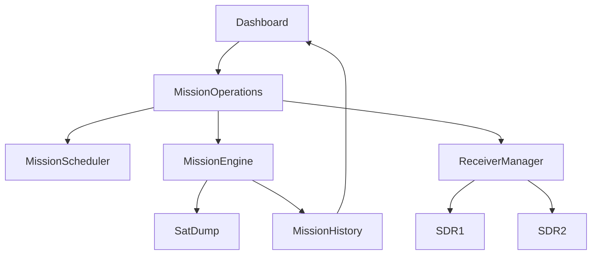

# SDRCC Architecture v2

**Project:** SDR Control Center (SDRCC)  
**Repository:** EyeVisionsNL/SDRCC  
**Branch:** develop  
**Status:** Draft v0.35.1  
**Laatste wijziging:** Juli 2026

---

# 1. Doel en ontwerpprincipes

## 1.1 Doel van SDRCC

SDR Control Center (SDRCC) is een modulair grondstation voor Software Defined Radio (SDR).

Het systeem automatiseert het plannen, uitvoeren, monitoren en archiveren van radio-opdrachten zoals:

- Satellietontvangst (METEOR, NOAA, toekomstige satellieten)
- ADS-B vliegtuigontvangst
- AIS scheepvaartontvangst
- Voice receivers
- Scanner plugins
- Toekomstige SDR plugins

Het uiteindelijke doel is één centraal platform waarin meerdere SDR-ontvangers zelfstandig en gelijktijdig verschillende taken kunnen uitvoeren.

---

## 1.2 Ontwerpfilosofie

SDRCC is gebouwd volgens een aantal eenvoudige uitgangspunten.

### Receiver First

De SDR ontvanger staat centraal.

Niet de missie bepaalt wat een receiver doet.

De receiver bepaalt welke missie uitgevoerd kan worden.

---

### Eén verantwoordelijkheid per module

Iedere module heeft precies één duidelijke taak.

Voorbeelden:

- Mission Scheduler plant missies.
- Mission Engine voert missies uit.
- Receiver Manager beheert beschikbare receivers.
- Dashboard toont informatie.

Taken worden niet gedupliceerd.

---

### Backend is de waarheid

De backend is altijd leidend.

De frontend bevat geen eigen logica over:

- missiestatus
- receiverstatus
- planning
- hardware

Het dashboard toont uitsluitend de toestand van de backend.

---

### Geen dubbele state

Iedere toestand bestaat slechts op één plaats.

Voorbeelden:

Mission Status:

Mission Engine

Receiver Status:

Receiver Manager

Scheduler Status:

Mission Scheduler

Hierdoor ontstaan geen conflicten tussen verschillende onderdelen.

---

### Kleine stabiele releases

Nieuwe functionaliteit wordt ontwikkeld in kleine stappen.

Iedere versie bevat:

- analyse
- implementatie
- testen
- installatiepakket
- rollback

Pas daarna volgt de volgende versie.

---

### Backwards compatible

Nieuwe architectuur mag bestaande functionaliteit niet onnodig breken.

Migraties gebeuren gefaseerd.

---

### Plugin gebaseerd

Nieuwe functionaliteit wordt zoveel mogelijk toegevoegd als plugin.

Hierdoor blijft de kern van SDRCC klein en onderhoudbaar.

---

# 2. Huidige architectuur

Onderstaande architectuur beschrijft de huidige hoofdstructuur van SDRCC.



## Componenten

### Dashboard

Webinterface voor bediening en monitoring.

Verantwoordelijkheden:

- Mission Control
- Receiver Monitor
- Mission History
- Live RF informatie
- Configuratie

---

### Mission Operations

Centrale orkestratielaag.

Combineert informatie uit:

- Mission Scheduler
- Mission Engine
- Receiver Manager

Hierdoor hoeft de frontend slechts één API te raadplegen.

---

### Mission Scheduler

Plant toekomstige missies.

Taken:

- satellietpasses berekenen
- wachtrij beheren
- startmoment bepalen

Voert geen missies uit.

---

### Mission Engine

Verantwoordelijk voor de volledige uitvoering van een missie.

Taken:

- receiver reserveren
- opname starten
- SatDump aansturen
- verwerking starten
- missie afronden

---

### Receiver Manager

Beheert alle beschikbare SDR ontvangers.

Taken:

- beschikbaarheid
- reserveringen
- actieve rol
- hardwarestatus

De Receiver Manager kent geen kennis van satellieten of plugins.

---

### SatDump

Externe decoder voor satellietontvangst.

SDRCC gebruikt SatDump als uitvoerende decoder en beheert uitsluitend het proces daaromheen.

---

### Mission History

Bewaart:

- opnames
- afbeeldingen
- logs
- statistieken
- metadata

Mission History is de centrale bron voor historische informatie.

---

# 3. Doelarchitectuur

De huidige architectuur vormt de basis voor een flexibel grondstation.

De volgende uitbreidingen zijn voorzien.

## Receiver Runtime

Nieuwe laag tussen Mission Engine en de daadwerkelijke plugins.

Taken:

- lifecycle beheren
- plugin laden
- plugin stoppen
- foutafhandeling
- resourcebeheer

---

## Plugin Framework

Iedere ontvangstmethode wordt een zelfstandige plugin.

Voorbeelden:

- METEOR
- NOAA
- ADS-B
- AIS
- Voice
- Scanner
- IQ Recorder

Nieuwe plugins kunnen worden toegevoegd zonder wijzigingen aan Mission Engine.

---

## Meerdere gelijktijdige missies

Toekomstige versies ondersteunen meerdere actieve receivers.

Voorbeeld:

SDR1:

- METEOR

SDR2:

- ADS-B

Beide functioneren onafhankelijk.

---

## Flexibele receiverrollen

Receivers krijgen geen vaste taak.

Iedere missie kiest dynamisch een geschikte receiver.

---

# 4. Hoofdmodules en verantwoordelijkheden

| Module | Verantwoordelijkheid |
|---------|----------------------|
| Dashboard | Gebruikersinterface |
| Mission Operations | Centrale API voor dashboard |
| Mission Scheduler | Missies plannen |
| Mission Engine | Missies uitvoeren |
| Receiver Manager | Receivers beheren |
| Receiver Runtime | Plugin lifecycle (toekomst) |
| SatDump | Satellietdecoder |
| Mission History | Historische gegevens |

---

# 5. Mission Lifecycle

```
Queued
    ↓
Scheduled
    ↓
Preparing
    ↓
Recording
    ↓
Processing
    ↓
Archiving
    ↓
Completed
```

Mission Engine is eigenaar van deze lifecycle.

---

# 6. Receiver Lifecycle

```
Idle
    ↓
Reserved
    ↓
Preparing
    ↓
Active
    ↓
Releasing
    ↓
Idle
```

Receiver Manager is eigenaar van deze lifecycle.

---

# 7. Plugin Lifecycle

Iedere plugin gebruikt dezelfde levenscyclus.

```
prepare()

start()

pause()

resume()

stop()

cleanup()
```

Hierdoor gedragen alle plugins zich op dezelfde manier.

---

# 8. API- en datastromen

Belangrijkste API's.

| API | Eigenaar |
|------|-----------|
| /api/mission-operations | Mission Operations |
| /api/mission-engine | Mission Engine |
| /api/mission-scheduler | Mission Scheduler |
| /api/receiver-manager | Receiver Manager |
| /api/history | Mission History |

Iedere API heeft één eigenaar.

---

# 9. Compatibiliteit en migratierichting

Nieuwe architectuur wordt gefaseerd ingevoerd.

Belangrijke uitgangspunten:

- bestaande API's blijven werken
- Receiver Manager blijft autoriteit
- Mission Engine blijft verantwoordelijk voor missies
- Receiver Runtime wordt stap voor stap toegevoegd
- plugins vervangen geleidelijk bestaande implementaties

Hierdoor blijven bestaande installaties bruikbaar tijdens de ontwikkeling.

---

# 10. Ontwikkelregels

Voor iedere wijziging gelden de volgende regels.

1. Analyse vóór implementatie.
2. Geen dubbele logica.
3. Eén eigenaar per verantwoordelijkheid.
4. Kleine stabiele releases.
5. Complete installatiepakketten.
6. Rollback moet altijd mogelijk zijn.
7. Dashboard bevat geen bedrijfslogica.
8. Backend is leidend.
9. Nieuwe functionaliteit bij voorkeur als plugin.
10. Architectuur aanpassen vóór grote implementaties.

---

# Slot

Dit document beschrijft de architectuur van SDRCC versie 2 en vormt de technische basis voor toekomstige uitbreidingen. Nieuwe functionaliteit wordt ontwikkeld binnen deze architectuur zodat SDRCC modulair, onderhoudbaar en uitbreidbaar blijft.
